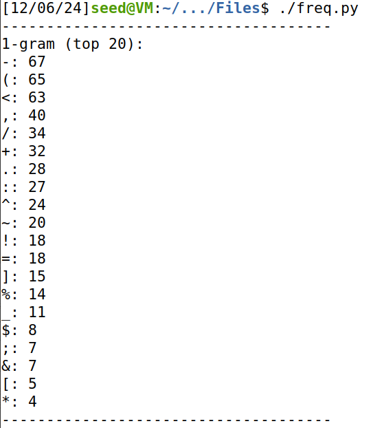
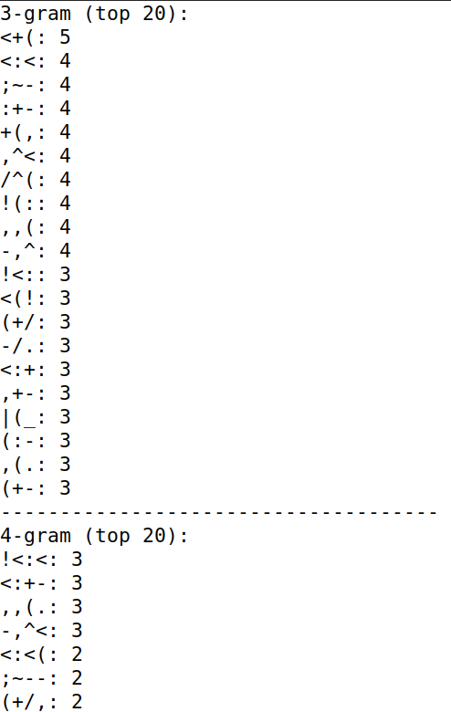
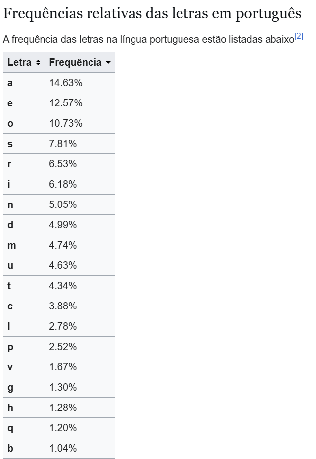
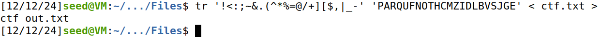
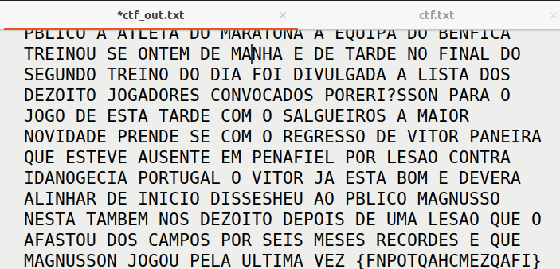

# CTF10

This document is a brief explanation of our resolution of the Classical Encryption CTF given to us during week 10.

## Recognition

First we start exploring the encrypted text to discover how the cipher used works and found that it uses a classical cipher. So we already know that the each symbol in the ecrypted text corresponds to a letter in the original text.

## Deciphering Methodology

To explore the cipher we start doing a frequency analysis using the python script given in the logbook9:

    <figure>
        
        <figcaption style="font-size: smaller">Figure 1: Frequency Analysis</figcaption>
    </figure>
    <figure>
        
        <figcaption style="font-size: smaller">Figure 2: Frequency Analysis</figcaption>
    </figure>

In these images, we can observe the characters that appear most frequently in the cipher (Figure 1) and the group of characters with the highest occurrence (Figure 2). This allows us to infer the corresponding letters for each character, considering that the text comes from a Portuguese newspaper.

After running the script and reviewing the frequency analysis provided, we can compare the results with the most commonly occurring letters in the Portuguese language.

    <figure>
        
        <figcaption style="font-size: smaller">Figure 3: Frequency Analysis of Portuguese Letters</figcaption>
    </figure>

We begin by selecting a group of four letters that could represent the word `para`. Since the letter `A` is the most commonly occurring letter in Portuguese, and the most frequent characters in the cipher are `- ( <`, the likelihood of one of these characters corresponding to `A` is high. By analyzing the most frequent group of four characters, we find that only one matches our word: `! < : <`. This is because the word `para` has the same character in both the second and fourth positions, which must correspond to the letter `A`. This alignment is confirmed by the fact that the character appears in the text as expected.

Next, we attempt to identify the word `que` as it contains another frequently occurring letter in Portuguese, `E`. This step proved more challenging because the word is shorter, and several groups appear frequently, making it harder to pinpoint the match. However, we can eliminate any groups where the first character corresponds to one that appears less often in the cipher, since the letter `Q` is not as frequent in Portuguese. We can also rule out groups where the third character is one that appears infrequently, as `E` is a letter that occurs quite often in the language. This helps narrow down the possibilities. By trying some possibilities we discover that with the characters, `; ~ -`, some incompleted words starts to appear.

After that, we began attempting to construct meaningful words and identified which letter each character represents.

Word by word we discover the letters that corresponds to each caracter and finally found the flag.

    <figure>
        
        <figcaption style="font-size: smaller">Figure 4: Substitution method used</figcaption>
    </figure>
    <figure>
        
        <figcaption style="font-size: smaller">Figure 5: Deciphered text and respective flag</figcaption>
    </figure>

