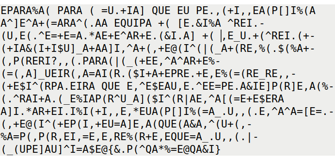
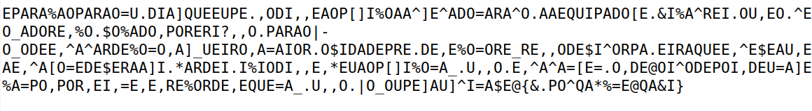
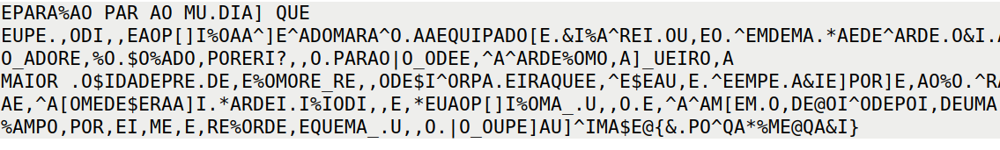
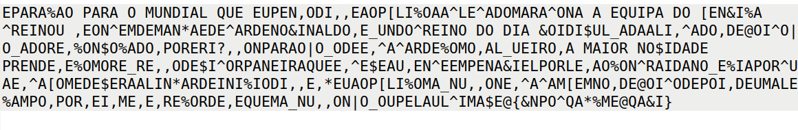

# CTF10

## Introduction

This document is a brief explanation of our resolution of the Classical Encryption CTF given to us during week 10.

## Recognition

First we start exploring the encrypted text to discover how the cipher used works and found that it uses a classical cipher. So we already know that the each symbol in the encrypted text corresponds to a letter of the original text.

This is our encrypted message:

```bash
-!<:<%<(!<:<(=~.+/<];~--~!-.,(+/,,-<(![]/%(<<^]-^<+(=<:<^(.<<-;~/!<+([-.&/%<^:-/.(~,-(.^-=+-=<.*<-+-^<:+-.(&/.<]+(,-_~.+(^:-/.(+(+/<&(/+/$~]_<+<<]/,^<+(,+-@(/^(|(_<+(:-,%(.$(%<+(,!(:-:/?,,(.!<:<(|(_(+--,^<^<:+-%(=(,<]_~-/:(,<=</(:.($/+<+-!:-.+-,-%(=(:-_:-,,(+-$/^(:!<.-/:<;~--,^-$-<~,-.^--=!-.<&/-]!(:]-,<(%(.^:</+<.(_-%/<!(:^~_<]($/^(:|<-,^<[(=-+-$-:<<]/.*<:+-/./%/(+/,,-,*-~<(![]/%(=<_.~,,(.-,^<^<=[-=.(,+-@(/^(+-!(/,+-~=<]-,<(;~-(<&<,^(~+(,%<=!(,!(:,-/,=-,-,:-%(:+-,-;~-=<_.~,,(.|(_(~!-]<~]^/=<$-@{&.!(^;<*%=-@;<&/}
```

## Deciphering Methodology

To explore the cipher we start doing a frequency analysis using the python script given in the logbook9:

<div align="center">
    <figure>
        
        <figcaption style="font-size: smaller">Figure 1: Frequency Analysis</figcaption>
    </figure>
    <figure>
        
        <figcaption style="font-size: smaller">Figure 2: Frequency Analysis</figcaption>
    </figure>
</div>

In these images, we can observe the characters that appear most frequently in the cipher (Figure 1) and the groups of characters (with sizes 3 or 4) with the highest occurrence (Figure 2). This allows us to infer the corresponding letters for each character, considering that the text comes from a Portuguese newspaper.

After running the script and reviewing the frequency analysis provided, we can compare the results with the most commonly occurring letters in the Portuguese language.

<div align="center">
    <figure>
        
        <figcaption style="font-size: smaller">Figure 3: Frequency Analysis of Portuguese Letters</figcaption>
    </figure>
</div>

Our first idea was to take a common word with a very unique configuration. We selected the word `para` because:

-It is a 4 letter word, meaning there are fewer options to select from;

-It contains the most common word twice, exactly in the second and forth positions.

We began by assuming with high confidence that the letter `a` would correspond to one of the following: `- ( <`. These 3 are by far the most common symbols on our encrypted text, and with that in mind it becames really clear that the word `para` is represented by `! < : <`, because of the repeating symbol in the second and forth positions and it being the most common 4-gram in our text.

The next word we tried to find was `que`, because it include another 2 vowels (numbers 2 and 10 in frequency in the portuguese language) and a very uncommon letter in the first position, while still being a very common word. We can eliminate any 3-letter sequences with common first letter and uncommon last letter since those positions have very polarized frequencies in our target word. After some trial and error we landed on `; ~ -` and started to see some incompleted words.

With the letters `PARQUE` already decyphered we can see clearly the word
`EQUIPA` desguised as 'EQU/PA'. After changing the `I`, this is what we see:

<div align="center">
    <figure>
        
        <figcaption style="font-size: smaller">Figure 4: Word 'Equipa' (after `PARQUEI`)</figcaption>
    </figure>
</div>

Then we started searching for words that connect the phrases like `do, da, de`.

This is the text after that:

<div align="center">
    <figure>
        
        <figcaption style="font-size: smaller">Figure 5: Word 'Do' (after `PARQUEIDO`)</figcaption>
    </figure>
</div>

We found `=AIOR` and decided to try the substitution of `=` with the letter `M`:

<div align="center">
    <figure>
        
        <figcaption style="font-size: smaller">Figure 6: Word 'Maior' (after `PARQUEIDOM`)</figcaption>
    </figure>
</div>

Separating some words that appear to make sense we found `MU.DIA]` that we thought was `MUNDIAL` :

<div align="center">
    <figure>
        
        <figcaption style="font-size: smaller">Figure 7: Word 'Mundial' (after `PARQUEIDOMNL`)</figcaption>
    </figure>
</div>

After that, we began attempting to construct meaningful words like `TREINO, NOVIDADE...` and identified which letter each character represents.

Word by word we discover the letters that corresponds to each caracter and finally found the flag.

<div align="center">
    <figure>
        
        <figcaption style="font-size: smaller">Figure 8: Substitution method used</figcaption>
    </figure>
    <figure>
        
        <figcaption style="font-size: smaller">Figure 9: Deciphered text and respective flag</figcaption>
    </figure>
</div>

The flag was: flag{fnpotqahcmezqafi}
