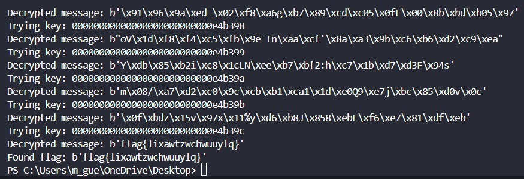

# CTF11

## Introduction

This document is a brief explanation of our resolution of the Weak Encryption CTF given to us during week 11.

The objective was to exploit a poorly designed key generation method to decrypt an encrypted flag without direct access to the symmetric key used for its encryption.

## Recognition

We where given this hexadecimal for our CTF:

```
e98b6f8376147fc47f66ac5d4b235896
7fd1aa16098c0d18b9fdaeca0318776d45645dabf6b2
```

We were then able to separate this in two parts:
- Nonce (in hexadecimal):
  ```
  e98b6f8376147fc47f66ac5d4b235896
  ```
- Ciphertext (in hexadecimal):
  ```
  7fd1aa16098c0d18b9fdaeca0318776d45645dabf6b2
  ```

We were also given a file called `cipherspec.py`. This file defined how keys were generated, encrypted, and decrypted. Specifically, we observed that the key generation used a deterministic structure: setting the first 13 bytes to `0x00` and randomizing only the last 3 bytes.

## Deciphering Methodology

With what we found in the recognition phase we then understood that because only the last 3 bytes were random it limited the number of possible keys to `256^3 = 16,777,216`, which is small enough to make a brute-force attack feasible.

We then developed the following Python script to conduct the attack:

```python
from cryptography.hazmat.primitives.ciphers import Cipher, algorithms, modes
import os

KEYLEN = 16

# Known structure of the key (first 13 bytes are 0x00, last 3 bytes are random)
def gen_key():
    return bytearray(b'\x00' * (KEYLEN - 3))  # First 13 bytes are fixed to 0x00

# Decryption function
def dec(k, c, nonce):
    cipher = Cipher(algorithms.AES(k), modes.CTR(nonce))
    decryptor = cipher.decryptor()
    msg = b""
    msg += decryptor.update(c)
    msg += decryptor.finalize()
    return msg

# Brute force attack to try all combinations for the last 3 bytes of the key
def brute_force_attack(hex_ciphertext, hex_nonce):
    # Convert hexadecimal inputs to binary (bytes)
    ciphertext = bytes.fromhex(hex_ciphertext)
    nonce = bytes.fromhex(hex_nonce)
    
    # Ensure the nonce is exactly 16 bytes
    if len(nonce) != 16:
        print(f"Error: Nonce length is {len(nonce)}, but must be 16 bytes for AES-CTR.")
        return
    
    # Known key structure (first 13 bytes are 0x00)
    partial_key = gen_key()
    
    # Brute force the last 3 bytes of the key
    for i in range(256**3):  # 256^3 possible combinations for the last 3 bytes
        last_3_bytes = i.to_bytes(3, byteorder='big')  # Convert the current guess to a 3-byte sequence
        key = partial_key + last_3_bytes  # Full key with the first 13 bytes fixed

        # Try decrypting the ciphertext with this key
        plaintext = dec(key, ciphertext, nonce)
        
        # Check if the plaintext looks like valid text or flag (this step depends on the specific format of your message)
        print(f"Trying key: {key.hex()}")
        print(f"Decrypted message: {plaintext}")
        
        # If you find the correct plaintext (e.g., a flag or recognizable text), stop the attack
        # You might want to check for specific characteristics of the flag or message format here.
        if b"flag" in plaintext:  # Modify this condition based on the known flag format
            print(f"Found flag: {plaintext}")
            break

# Example usage
hex_ciphertext = "7fd1aa16098c0d18b9fdaeca0318776d45645dabf6b2"  # Replace this with the actual ciphertext in hexadecimal
hex_nonce = "e98b6f8376147fc47f66ac5d4b235896"  # Replace this with the actual nonce in hexadecimal
brute_force_attack(hex_ciphertext, hex_nonce)
```

We ran this script and after some time and after a lot of tries, we found the flag.

<div align="center">
    <figure>
        
        <figcaption style="font-size: smaller">Figure 1: Flag found </figcaption>
    </figure>
</div>

The flag was: flag{lixawtzwchuuylq}.

## Tasks

### Task1 1

**Question1:** How can I use this ciphersuite to encrypt and decrypt data?

**Answer1:**  The `cipherspec.py` file provides functions to encrypt and decrypt data using AES in CTR mode. Encryption is done by generating a key (partially fixed and partially random) and using it alongside a 16-byte nonce. Decryption uses the same key and nonce to recover the plaintext.

**Question2:** How can I exploit the observed vulnerability to break the code?

**Answer2:** The vulnerability is that the first 13 bytes of the key are fixed (`0x00`), and only the last 3 bytes are random. This drastically reduced the key space to 16,777,216 possible keys. By brute-forcing all combinations for the last 3 bytes, it is possible to decrypt the ciphertext and recover the plaintext flag.

**Question3:** How can I automate this process to ensure my attack detects the flag?

**Answer3:** We developed a python script to automate the brute-force attack. It tests each possible key, decrypts the ciphertext, and checks for recognizable patterns in the decrypted plaintext. When the correct key is found, the flag is revealed.

### Task 2

**Question:** How large would the key offset need to be in `cipherspec.py` to make it infeasible for personal machines to break the key within 10 years?

**Answer:** To calculate the offset needed for it to take 10 years we started by running our program and averaging our encryptation speed. We got to key  `00000000000000000000000000644125` in 200 seconds, which is `6570277 / 200 = 32851.385` keys per second.

At this rate, in 10 years we could check (using brute force) `10 * 365 * 24 * 60 * 60 * 32851.385 = 10360012770000` keys. For a key to be safe from brute force attacks it would need to randomize at least `log256 10360012770000 = 5,4` bytes, meaning 6 bytes is the minimum amount of bytes for a key to be safe for at least 10 years of brute forcing from a personal computer. 


### Task 3

**Question:** Why is using a 1-byte nonce that is not transmitted over the network not an effective countermeasure for strengthening the security of this cipher?

**Answer** A 1-byte nonce introduces only 256 possible values. Even if the nonce is not transmitted over the network, an attacker can simply try all 256 possible nonce values for every possible key during a brute-force attack. Also only having a 1-byte nonce makes it easy to brute force the cipher.
