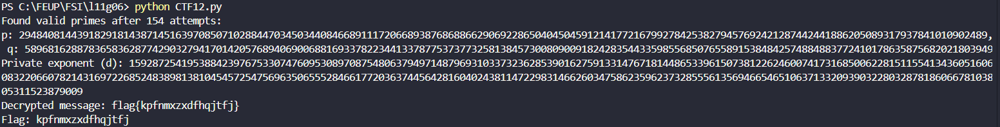

# CTF12

## Introduction

This document is a brief description of our resolution to the RSA CTF given to us during week 12.

The objective was to explore the problem of factoring an RSA module with partial knowledge of the primes used to calculate it.

## Recognition

We were given this file with important information to resolve this CTF:

```
Public exponent: 65537
Modulus: 1738622117183213887075009828299861476612472124072633023678105177251600758725429566362290186650567755814218017658092465084804956869534071036307910187878480476401377874135577842859015717998932001669603828867765410696201358510137657236096830539201349719227032839563768580573955914691994191585467645220386577597526576993098944324314129061
d3f9c4ccedd30d8ed7213f2d7d7cdbf7af672e41044c44c637b9777a767ea82a58db0339afb4104b8da58e96b4bb5874d6a686c4ab9f6ad0eb87a20053c968d5ee0119a829a67029162a476a75e85cbd8525f405fdc7020dcf1e62f192ae36766c6cd8d9b27e76f5b0c40ea38e4299d70aec0dd143274369f28d74d56d655aed763ac42c63e86e71b3cb03000000000000000000000000000000000000000000000000000000000000000000000000000000000000000000000000000000000000000000000000000000000000000000000000000000000000000000000000000000000000000000000000000000000000000000000000000000000000000000
```

## Deciphering Methodology

In the recognition phase we were able to set a stratagy to breack the RSA encryption:

### 1. Generate the prime numbers close to a given candidate values calculated with the given formulas `2^500+(((t-1)*10+g)//2)` and `2^501+(((t-1)*10+g)//2)`.

```python
# Function to find the closest prime to a given candidate using Miller-Rabin
def getClosePrimesInRange(candidate, range_size=20):
    """
    Function to find a range of primes close to a given candidate.
    Searches both above and below the candidate to find a list of closest primes.
    """
    primes = []
    offset = 0

    # Find primes above and below candidate
    while len(primes) < range_size:
        if sympy.isprime(candidate + offset):
            primes.append(candidate + offset)
        if sympy.isprime(candidate - offset) and (candidate - offset > 1):
            primes.append(candidate - offset)
        
        offset += 1  # Increment offset and check next candidates

    return primes
```

### 2. Verify if there are two numbers that by multiply to each other results in the correct number given to us as `Modulus`.

```python
for p in p_range:
        for q in q_range:
            attempts += 1
            if p * q == n:
                print(f"Found valid primes after {attempts} attempts:")
                print(f"p: {p}, q: {q}")
                break
        else:
            continue
        break
    else:
        print("Failed to find valid primes after maximum attempts.")
        return
```

### 3. Find the private exponent that is used to encrypt the message

In the file we were given they calculate this exponent like this:

```python
def getParams(i, j):
    p = getRandomPrime(i)
    q = getRandomPrime(j)
    n = p*q
    phi = (p-1) * (q-1)
    e = 0x10001 
    d = extendedEuclidean(e, phi) 
    return (p, q, n, phi, e, d)
```

so we need to do the inverse:

```python
# Step 5: Compute phi(n) = (p - 1) * (q - 1)
phi_n = (p - 1) * (q - 1)

# Step 6: Compute the private key d
d = mod_inverse(e, phi_n)
print(f"Private exponent (d): {d}")
```

### 4. After getting all the information we need we can now decrypt the message.

```python
def decrypt(ciphertext, d, n):
    # Perform RSA decryption without padding
    c_int = int.from_bytes(ciphertext, "little")  # Convert bytes to int
    m_int = pow(c_int, d, n)  # RSA decryption
    m = m_int.to_bytes(256, "little")  # Convert decrypted int back to bytes (256 bytes)
    return m.decode(errors="ignore").rstrip('\x00')  # Strip padding and decode
```

### Full Script

Here is the combination of all this auxiliary methods in just one script that we use to decrypt the message:

```python
import sympy
from sympy import mod_inverse
import binascii
from Crypto.PublicKey import RSA
from Crypto.Cipher import PKCS1_v1_5
from Crypto.Util.Padding import unpad

# Function to find the closest prime to a given candidate using Miller-Rabin
def getClosePrimesInRange(candidate, range_size=20):
    """
    Function to find a range of primes close to a given candidate.
    Searches both above and below the candidate to find a list of closest primes.
    """
    primes = []
    offset = 0

    # Find primes above and below candidate
    while len(primes) < range_size:
        if sympy.isprime(candidate + offset):
            primes.append(candidate + offset)
        if sympy.isprime(candidate - offset) and (candidate - offset > 1):
            primes.append(candidate - offset)
        
        offset += 1  # Increment offset and check next candidates

    return primes

# Function to read the ciphertext and public parameters from the file
def read_encrypted_file(file_path):
    with open(file_path, "r") as f:
        # Read public exponent and modulus
        e_line = f.readline().strip()
        n_line = f.readline().strip()
        ciphertext_hex = f.readline().strip()

        # Extract e and n
        e = int(e_line.split(":")[1].strip())
        n = int(n_line.split(":")[1].strip())
        
        # Convert ciphertext from hex to bytes
        ciphertext = binascii.unhexlify(ciphertext_hex)

        return e, n, ciphertext

# RSA decryption function
def decrypt(ciphertext, d, n):
    # Perform RSA decryption without padding
    c_int = int.from_bytes(ciphertext, "little")  # Convert bytes to int
    m_int = pow(c_int, d, n)  # RSA decryption
    m = m_int.to_bytes(256, "little")  # Convert decrypted int back to bytes (256 bytes)
    return m.decode(errors="ignore").rstrip('\x00')  # Strip padding and decode

# Function to decrypt the ciphertext based on the provided public key
def solve_ctf(e, n, ciphertext, t=11, g=6):
    # Step 1: Calculate the offset based on t and g
    offset = ((t - 1) * 10 + g) // 2
    
    # Step 2: Calculate p and q based on the formula
    p_candidate = 2**(500 + offset)
    q_candidate = 2**(501 + offset)

    # Step 3: Generate a range of primes around the candidates
    p_range = getClosePrimesInRange(p_candidate)
    q_range = getClosePrimesInRange(q_candidate)

    attempts = 0
    max_attempts = len(p_range) * len(q_range)  # Total combinations to check

    # Step 4: Try combinations of p and q from the generated prime ranges
    for p in p_range:
        for q in q_range:
            attempts += 1
            if p * q == n:
                print(f"Found valid primes after {attempts} attempts:")
                print(f"p: {p}, q: {q}")
                break
        else:
            continue
        break
    else:
        print("Failed to find valid primes after maximum attempts.")
        return

    # Step 5: Compute phi(n) = (p - 1) * (q - 1)
    phi_n = (p - 1) * (q - 1)

    # Step 6: Compute the private key d
    d = mod_inverse(e, phi_n)
    print(f"Private exponent (d): {d}")

    # Step 7: Decrypt the ciphertext using the private key
    decrypted_message = decrypt(ciphertext, d, n)
    print(f"Decrypted message: {decrypted_message}")

    # Step 8: Extract the flag
    if "flag{" in decrypted_message:
        flag = decrypted_message.split("flag{")[1].split("}")[0]
        print(f"Flag: {flag}")
    else:
        print("Failed to extract the flag from the decrypted message.")
        print("Full decrypted message:", decrypted_message)

if __name__ == "__main__":
    # Read the public key and ciphertext from the file
    e, n, ciphertext = read_encrypted_file("CTF12_L11G06.cph")

    # Decrypt the ciphertext and extract the flag
    solve_ctf(e, n, ciphertext)
```

We ran this script and we found the flag:

<div align="center">
    <figure>
        
        <figcaption style="font-size: smaller">Figure 1: Flag found </figcaption>
    </figure>
</div>

The flag was: `flag{kpfnmxzxdfhqjtfj}`

