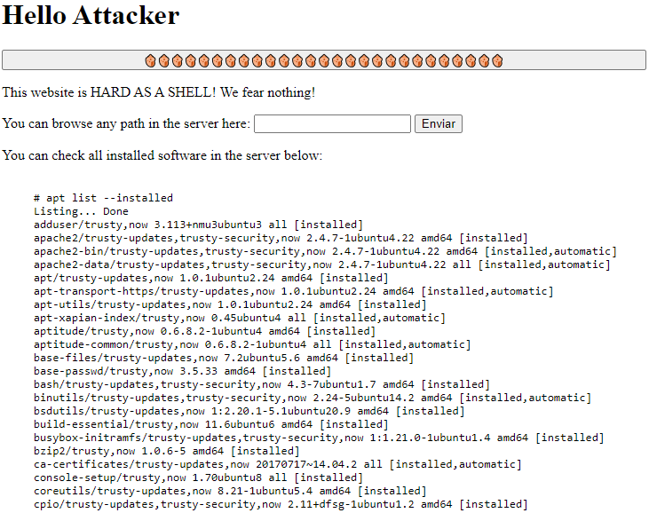
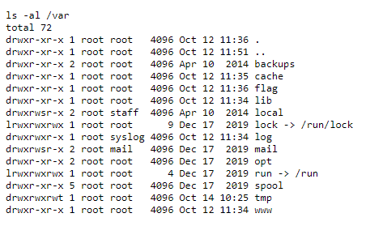
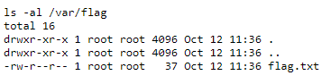
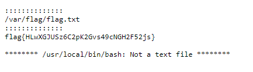
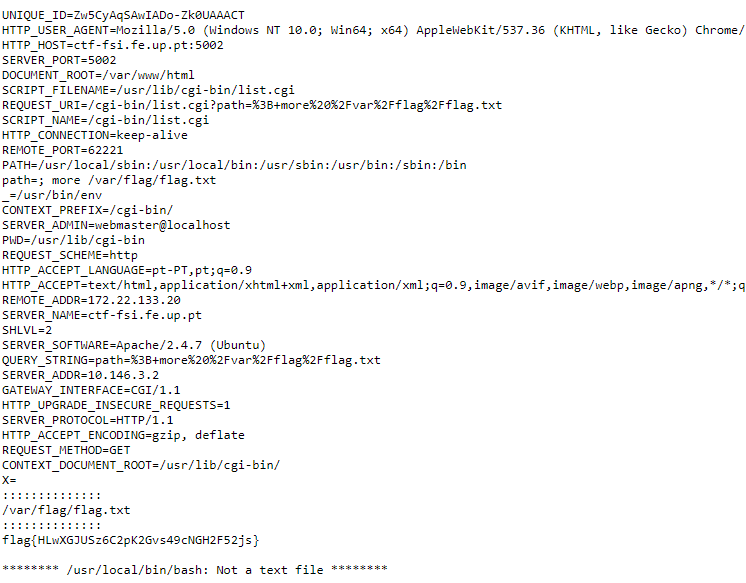

# CTF4

This document is a brief explanation of our resolution of the Environment Variables CTF 4.

    <figure>
        
        <figcaption style="font-size: smaller;">Image of the site.</figcaption>
    </figure>

## Recognition

The first thing we notticed when looking at the site was that all the verions of the installed software in the server were in a list in the main page.

Then we wanted to test the search bar. We typed "teste", and found out that everything we write in the search runs with the command "ls -al" in the bash directly. This command lists every file in any given directory, so we used this, combined with the fact that the URL changes acording to input, to navigate the file system.

URL do teste = http://ctf-fsi.fe.up.pt:5002/cgi-bin/list.cgi?path=teste

    <figure>
        
        <figcaption style="font-size: smaller;">Image of the site searching for "teste".</figcaption>
    </figure>
    <figure>    
        
        <figcaption style="font-size: smaller;">Image of the site after searching "teste".</figcaption>
    </figure>

## Searching and Choosing for Vulnerabilities

We wanted to find a CVE related with injecting commands directly in the bash shell.
As mentioned before, the main page of the site lists the versions of everything used in the site and the version of the bash was 4.3 (bash/trusty-updates,trusty-security,now 4.3-7ubuntu1.7 amd64 [installed]) .

We found a site (https://www.trendmicro.com/vinfo/us/threat-encyclopedia/vulnerability/6033/bash-vulnerability-shellshock-cve20146271) with information about CVE-2014-6271, that affected versions of the bash up to and including 4.3, it was exacly what we were looking for.

## Exploring the Vulnerabilities

To do the attack, the first thing we tried was going to the root. To do that we used "/" (in URL notation is also "%2F") directly in the search.

URL when searching "/" = http://ctf-fsi.fe.up.pt:5002/cgi-bin/list.cgi?path=%2F

That gave us a list of all the directories present in the root.

    <figure>
        
        <figcaption style="font-size: smaller;">Image of the site searching for "/".</figcaption>
    </figure>
    <figure>    
        
        <figcaption style="font-size: smaller;">Image of the site after searching "/"</figcaption>
    </figure>

With this list in hands we started to search inside the directories searching for something about the flag.

URL entering one of this directories (bin) = http://ctf-fsi.fe.up.pt:5002/cgi-bin/list.cgi?path=%2Fbin

We searched some directories until we tried the last one (/var)...

URL entering var = http://ctf-fsi.fe.up.pt:5002/cgi-bin/list.cgi?path=%2Fvar

    <figure>
        
        <figcaption style="font-size: smaller;">Image of the site after changing the URL to "...%2Fvar".</figcaption>
    </figure>

... and found a directory inside named flag.

URL entering flag = http://ctf-fsi.fe.up.pt:5002/cgi-bin/list.cgi?path=%2Fvar%2Fflag

    <figure>
        
        <figcaption style="font-size: smaller;">Image of the site after changing the URL to "...%2Fvar%2Fflag".</figcaption>
    </figure>

Inside the flag directory we found a text file named flag.txt that should (hopefully) have the flag.

To open this file directly in the bash we tried using the "cat" command.

URL entering flag.txt using "cat" = http://ctf-fsi.fe.up.pt:5002/cgi-bin/list.cgi?path=%2F+cat%20%2Fvar%2Fflag%2Fflag.txt

With this command it didn't work, so we searched for some other command that would do the same thing. 
We found "more" and "less" that had basically the same function of reading the file.

URL entering flag.txt using "more" = http://ctf-fsi.fe.up.pt:5002/cgi-bin/list.cgi?path=%2F+more%20%2Fvar%2Fflag%2Fflag.txt

    <figure>
        
        <figcaption style="font-size: smaller;">Image of the site after changing the url to be "...%2F+more%20%2Fvar%2Fflag%2Fflag.txt".</figcaption>
    </figure>

And inside the file, as shown in the image we saw the flag: flag{HLwXGJUSz6C2pK2Gvs49cNGH2F52js}.

## How to Prevent

The best way to prevent this exploit from happening is to update the Bash version to one after 4.3, so that it is not affected by this vulnerability.

Other way to solve this is to filter the input that the user can write, because allowing users to write and run unfiltered text is always a risc.

### Extras about the attack

The way we operated this attack is very straightforward, because the code doesn't stop even though we are running chain commands.

If the way we attacked didn't work, a ";" could be added to separate the various commands ("%3B" if using the URL), still allowing the attacker to perform the exploit.

URL with ";" : http://ctf-fsi.fe.up.pt:5002/cgi-bin/list.cgi?path=%3B+more%20%2Fvar%2Fflag%2Fflag.txt

    <figure>
        
        <figcaption style="font-size: smaller;">Image of the site.</figcaption>
    </figure>

