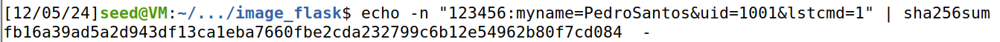

# Hash Lenght Extension Attack

## Introduction

In this logbook we explore hash lenght extension attacks and learn how they work.

## Task 1

In this task we are challenged to send a benign request to the server in order to see how it responds.

The blueprint for our request is as follows:

```bash
http://www.seedlab-hashlen.com/?myname=<name>&uid=<need-to-fill>&lstcmd=1&mac=<need-to-calculate>
```

We then filled this with our information:

```bash
http://www.seedlab-hashlen.com/?myname=PedroSantos&uid=1001&lstcmd=1&mac=<need-to-calculate>
```

To calculate the mac value that we needed, we used the following command:

```bash
echo -n "123456:myname=PedroSantos&uid=1001&lstcmd=1" | sha256sum
```

The output is the mac that we wanted: 

```bash
fb16a39ad5a2d943df13ca1eba7660fbe2cda232799c6b12e54962b80f7cd084
```

<div align="center">
    <figure>
        
        <figcaption style="font-size: smaller">Figure 1: Mac calculated using the terminal</figcaption>
    </figure>
</div>

We finally have the full request we need:

```bash
http://www.seedlab-hashlen.com/?myname=PedroSantos&uid=1001&lstcmd=1&mac=fb16a39ad5a2d943df13ca1eba7660fbe2cda232799c6b12e54962b80f7cd084
```

## Task 2

In this task we are supposed to create a padding for this message: `1001:myname=PedroSantos&uid=123456&lstcmd=1`. Firstly we need to know the length of the padding, and as the string is 43 bytes long, the padding should be 64 - 43 = 21 bytes. Knowing that our string is 43 bytes long we need to add 43 * 8 = 344 (in hexadecimal) to the end of our padding. This is how it turned out:

```bash
"1001:myname=PedroSantos&uid=123456&lstcmd=1"
"\x80"
"\x00\x00\x00\x00\x00\x00\x00\x00\x00\x00"
"\x00\x00"
"\x00\x00\x00\x00\x00\x00\x01\x58"
```

## Task 3
