# Hash Lenght Extension Attack

## Introduction

In this logbook, we document the process of setting up SSL/TLS certificates.

We used docker for the setup, and the first step was changing the `/etc/hosts` file and adding the following lines:
```
10.9.0.80 www.bank32.com
10.9.0.80 www.Couto2024.com
```

## Question 1

### Task 1

We started by copying the default OpenSSL configuration file to our working directory.

```bash
cp /usr/lib/ssl/openssl.cnf ./openssl.cnf
```
In the configuration file, we ensured the following paths were set:

```bash
dir = ./demoCA          # Working directory for CA files
certs = $dir/certs      # Issued certificates directory
crl_dir = $dir/crl      # Certificate Revocation List directory
database = $dir/index.txt  # Database index file
new_certs_dir = $dir/newcerts  # Directory for new certificates
serial = $dir/serial        # Serial number file
```
And we also made sure to write the following line inside that file.

```bash
unique_subject = no
```

We then generated a self-signed certificate for the CA, using the following command:

```bash
openssl req -x509 -newkey rsa:4096 -sha256 -days 3650 \
-keyout ca.key -out ca.crt
```

<div align="center">
    <figure>
        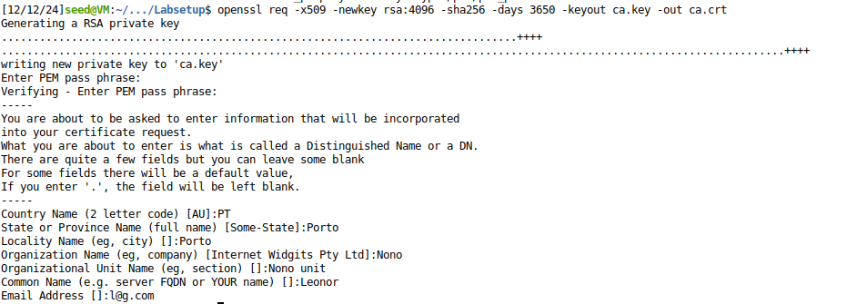
        <figcaption style="font-size: smaller">Figure 1: ?? </figcaption>
    </figure>
</div>

And this command generated this files:
- ca.key: The private key of the CA.
- ca.crt: The self-signed certificate.

Then we used this command inspect the CA certificate.

```bash
openssl x509 -in ca.crt -text -noout
```
In this certificate we looked especially at two things.
We looked for the CA Certificate Indicator that would confirm it is a CA certificate and found it: `CA:TRUE`.

<div align="center">
    <figure>
        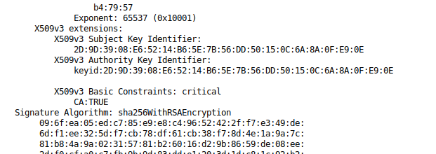
        <figcaption style="font-size: smaller">Figure 2: CA Certificate with CA:TRUE </figcaption>
    </figure>
</div>

And then we observed that the Issuer and Subject fields were identical.

<div align="center">
    <figure>
        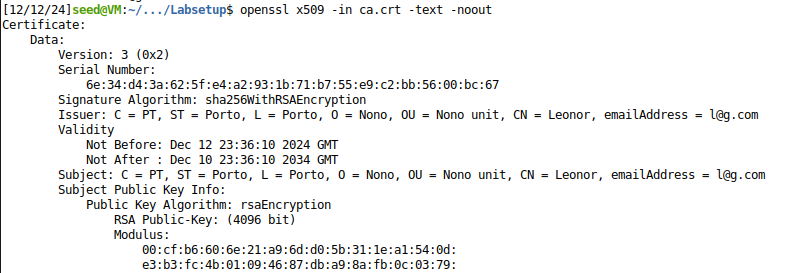
        <figcaption style="font-size: smaller">Figure 3: Matching Issuer and Subject fields. </figcaption>
    </figure>
</div>

To end this task, we inspected the RSA private key.

```bash
openssl rsa -in ca.key -text -noout
```
And we found the following RSA components:

- Modulus (n) : A large hexadecimal number used in the RSA algorithm.

<div align="center">
    <figure>
        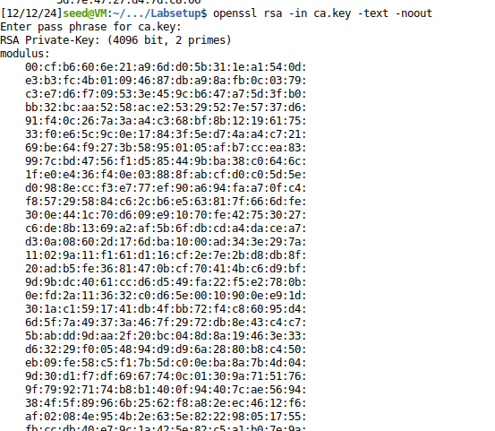
        <figcaption style="font-size: smaller">Figure 4: Modulus (n) </figcaption>
    </figure>
</div>

- Public exponent (e): Value of the public exponent.
- Private exponent (d) : The corresponding private key.

<div align="center">
    <figure>
        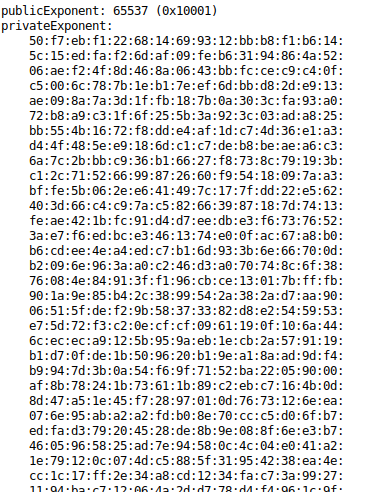
        <figcaption style="font-size: smaller">Figure 5: Public (e) and Private (d) exponents </figcaption>
    </figure>
</div>

- Prime factors (p and q) : Two prime numbers used to calculate the modulus.

<div align="center">
    <figure>
        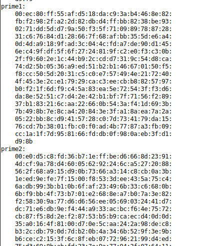
        <figcaption style="font-size: smaller">Figure 6: Prime factors (p, q) </figcaption>
    </figure>
</div>

### Task 2

In this task we started by generating a Certificate Signing Request (CSR) and a private key for `www.Couto2024.com`.

```bash
openssl req -newkey rsa:2048 -sha256 \
-keyout server.key -out server.csr \
-subj "/CN=www.Couto2024.com/O=Nono/C=PT" \
-passout pass:dees
```
And with that command 2 files were generated:
- server.key: Your web server's private key.
- server.csr: The certificate signing request.

We then ran a command to view the content of the CSR.
This allowed us to see that the subject field matched the imput from before ("www.Couto2024.com").

```bash
openssl req -in server.csr -text -noout
```

<div align="center">
    <figure>
        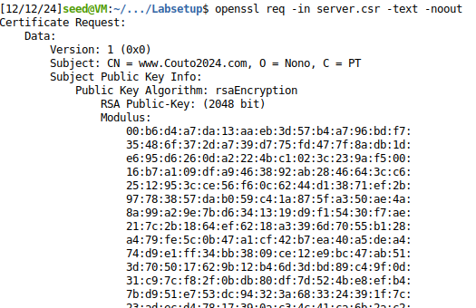
        <figcaption style="font-size: smaller">Figure 7: ?? </figcaption>
    </figure>
</div>

And then we opened the file with the private key.

```bash
openssl rsa -in server.key -text -noout
```
Here we confirmed the presence of the same key components as before, but with diferent content (Modulus (n), Public exponent (e) and Private exponent (d) and Prime factors (p and q)).

<div align="center">
    <figure>
        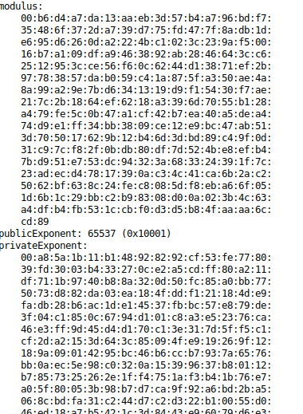
        <figcaption style="font-size: smaller">Figure 8: ?? </figcaption>
    </figure>
    <figure>
        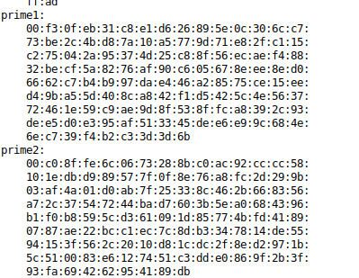
        <figcaption style="font-size: smaller">Figure 9: ?? </figcaption>
    </figure>
</div>

Lastly, in this task, we want to add Subject Alternative Names (SANs), and to do that we had to regenerate the CRS but now with SANs.

```bash
openssl req -newkey rsa:2048 -sha256 \
-keyout server.key -out server.csr \
-subj "/CN=www.Couto2024.com/O=Nono/C=PT" \
-addext "subjectAltName = DNS:www.Couto2024.com, DNS:www.Couto2024A.com, DNS:www.Couto2024B.com" \
-passout pass:dees
```

To confirm SANs were added, we ran:

```bash
openssl req -in server.csr -text -noout
```
And with that we were able to see the `X509v3 Subject Alternative Name` field with all the sepecific domains.

<div align="center">
    <figure>
        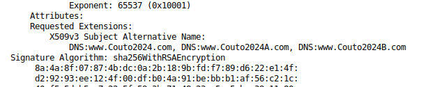
        <figcaption style="font-size: smaller">Figure 10: CSR details showing SANs </figcaption>
    </figure>
</div>

### Task 3

We started by changing the file `openssl.cnf` to make sure that it contained the following line:

```
copy_extensions = copy
```

Then we used the following command to sign the `server.csr` file with our CA’s private key and certificate:

```bash
openssl ca -config openssl.cnf -policy policy_anything \
-md sha256 -days 3650 \
-in server.csr -out server.crt -batch \
-cert ca.crt -keyfile ca.key
```
Command explanation:
- config openssl.cnf: Specifies the configuration file.
- policy policy_anything: Uses the less restrictive policy for certificate issuance.
- md sha256: Hash algorithm for signing.
- days 3650: Validity period for the certificate (10 years).
- in server.csr: Input CSR file to be signed.
- out server.crt: Output file for the signed certificate.
- cert ca.crt: The CA's public certificate.
- keyfile ca.key: The CA's private key.

After running the command, a signed certificate file (server.crt) was successfully generated.

<div align="center">
    <figure>
        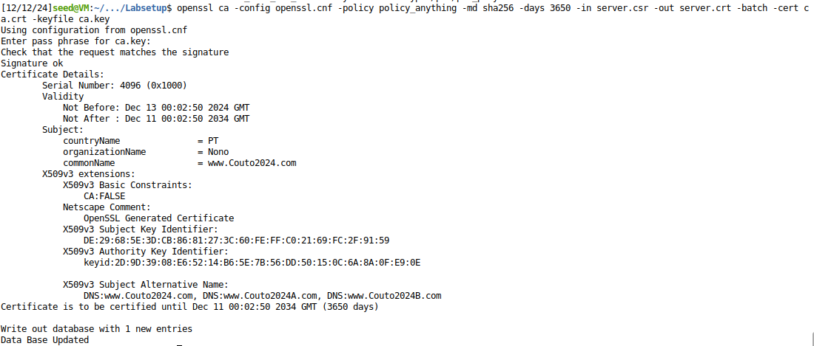
        <figcaption style="font-size: smaller">Figure 11: ?? </figcaption>
    </figure>
</div>


To ensure the signed certificate is valid and contains the required fields, we inspected its contents using the following command:

```bash
openssl x509 -in server.crt -text -noout
```

And we ensured that the `X509v3 Subject Alternative Name` matched the specified SANs.

```
X509v3 Subject Alternative Name:
    DNS:www.Couto2024.com, DNS:www.Couto2024A.com, DNS:www.Couto2024B.com
```
<div align="center">
    <figure>
        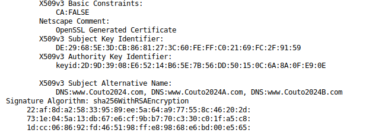
        <figcaption style="font-size: smaller">Figure 12: SANs in the signed certificate </figcaption>
    </figure>
</div>

To finish this task, we confirmed that the Issuer field matched our CA, confirming that our CA successfully signed the certificate.

<div align="center">
    <figure>
        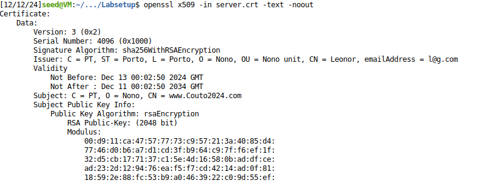
        <figcaption style="font-size: smaller">Figure 13: Issuer details confirming CA signature </figcaption>
    </figure>
</div>

With this task successfully finished we now have the following files:
- server.key: Server's private key.
- server.crt: Signed server certificate.

### Task 4

TODO

### Task 5

TODO

### Task 6

TODO


## Question 2

TODO

Apesar de assumirmos que estas autoridades de certificação são resistentes a ataques, realisticamente, devemos considerar sempre a possibilidade de serem comprometidas. Indique um mecanismo que permita reagir a essa ocorrência e impedir ataques, e que medidas um adversário pode tomar para evitar que esse mecanismo o impeça de tirar partido de uma autoridade de certificação comprometida.