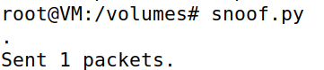
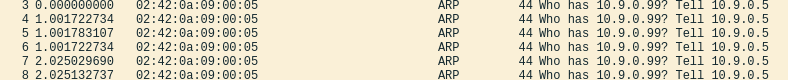

# Sniffing and Spoofing

## Introduction

In this logbook, we will undestand better the mechanisms of monitoring and manipulate the trafic.

We used docker for the setup, and in this logbook we have 3 docker containers.

<div align="center">
    <figure>
        
        <figcaption style="font-size: smaller">Figure 1: Docker Containers Running </figcaption>
    </figure>
</div>

We then use `ifconfig` to find the interface with the IP address `10.9.0.1`:

<div align="center">
    <figure>
        
        <figcaption style="font-size: smaller">Figure 2: Interface with the IP address `10.9.0.1` </figcaption>
    </figure>
</div>

Our network interface is named `br-449382b66784`.

## Task 1

To introduce this next tasks we start by running a simple program using Scapy, that we will need for the next tasks.

We can run Scapy programs 2 ways.
The first by just running the python program like we are used to:

```py
#view mycode.py 
#!/usr/bin/env python3
from scapy.all import * 

a=IP() 
a.show()
```

<div align="center">
    <figure>
        
        <figcaption style="font-size: smaller">Figure 3: Runing the python script </figcaption>
    </figure>
</div>

The second way can be sometimes more convinient by just runing Scapy code interactively:

<div align="center">
    <figure>
        
        <figcaption style="font-size: smaller">Figure 4: Runing the python code interactively </figcaption>
    </figure>
</div>


### Task 1.1 

On this task we sniffed the packets on our network interface, with the help of the following python script.

```python
#!/usr/bin/env python3
from scapy.all import * 

def print_pkt(pkt):
    pkt.show() 

pkt = sniff(iface='br-449382b66784', filter='icmp', prn=print_pkt)

```
The iface is the network interface is name especific for us, so we changed it to `br-449382b66784`

#### **Task 1.1A**

To start we opened one terminal in each container, host A, host B and seed-attacker.

In the seed-atacker one we ran:

```bash
chmod a+x sniffer.py
```

This gave our program root privileges.

So we started running the script.

<div align="center">
    <figure>
        
        <figcaption style="font-size: smaller">Figure 5: Runing the python script with root privileges </figcaption>
    </figure>
</div>

Then in container host A we used the ping command to ping the IP of the host B.

```bash
ping 10.9.0.6 -c 5
```

<div align="center">
    <figure>
        
        <figcaption style="font-size: smaller">Figure 6: From host A ping host B IP </figcaption>
    </figure>
</div>

And in the terminal with root privileges where we where running the `sniffer.py` script:

<div align="center">
    <figure>
        
        <figcaption style="font-size: smaller">Figure 7: Captured packets </figcaption>
    </figure>
</div>

Here we here able to see the captured packets displayed with detailed information for each layer (Ethernet, IP, ICMP and RAW).

```bash
###[ Ethernet ]### 
  dst       = 02:42:0a:09:00:06
  src       = 02:42:0a:09:00:05
  type      = IPv4
###[ IP ]### 
     version   = 4
     ihl       = 5
     tos       = 0x0
     len       = 84
     id        = 7075
     flags     = DF
     frag      = 0
     ttl       = 64
     proto     = icmp
     chksum    = 0xaea
     src       = 10.9.0.5
     dst       = 10.9.0.6
     \options   \
###[ ICMP ]### 
        type      = echo-request
        code      = 0
        chksum    = 0x45ee
        id        = 0x9
        seq       = 0x1
###[ Raw ]### 
           load      = '\x96\xbajg\x00\x00\x00\x00\xef\x12\x03\x00\x00\x00\x00\x00\x10\x11\x12\x13\x14\x15\x16\x17\x18\x19\x1a\x1b\x1c\x1d\x1e\x1f !"#$%&\'()*+,-./01234567'
```
Layers:
- Ethernet: Contains MAC addresses and type of the encapsulated protocol (IPv4).
- IP: Contains source and destination IPs, protocol type (ICMP here).
- ICMP: Contains specific ICMP details, such as echo-request/echo-reply.


And when we to to run the `sniffer.py` script without permitions, we can´t:

<div align="center">
    <figure>
        
        <figcaption style="font-size: smaller">Figure 8: Trying to run the script without permitions </figcaption>
    </figure>
</div>  

With root privileges packet sniffing works because root access allows the script to open raw sockets and listen to all packets on the interface.
Without the script can not access raw sockets due to system restrictions, which is a security feature to prevent unauthorized sniffing.

#### **Task 1.1B**

In this task we will set some filters and redo the sniffing to see the resilts.

- **Capture only the ICMP packet**

This filter is the same we used in the last task, so the results will be the same.

```python
pkt = sniff(iface='br-449382b66784', filter='icmp', prn=print_pkt)
```

- **Capture any TCP packet that comes from a particular IP and with a destination port number 23**

To so this, we need to change the `filter` to be `"tcp and src host 10.9.0.5 and dst port 23"`

`10.9.0.5` is the IP of host A, so we whave now filtered all the TCP packets that come from host A and with a destination port number 23 (`and dst port 23`)`.

```python
pkt = sniff(iface='br-449382b66784', filter="tcp and src host 10.9.0.5 and dst port 23", prn=print_pkt)
```

Just like in the last time we ran a command in host A, but a diferent one to ensure that this packet will catched by our filter.

```bash
echo "TESTE" > /dev/tcp/10.9.0.6/23
```

And in the sniffer terminal we obtained:

<div align="center">
    <figure>
        
        <figcaption style="font-size: smaller">Figure 9: Sniffing using the filter </figcaption>
    </figure>
</div>  

- **Capture packets comes from or to go to a particular subnet**

To do this first we need to choose a subnet, that is not the one we are already using. 
So we used `ifconfig` command to display a list of all the interfaces `enp0s3`.

<div align="center">
    <figure>
        
        <figcaption style="font-size: smaller">Figure 10: The chosen interface </figcaption>
    </figure>
</div>  

By applying the 255.255.255.0 netmask to the interface - 10.0.2.15 - we achieved 10.0.2.0/24:

To the interface `10.0.2.15` we apllied the `255.255.255.0` netmask and obtained the subnet `10.0.2.0/24`.

So we then applied this filter in our siffing code.

```python
pkt = sniff(iface='br-449382b66784', filter="net 10.0.2.0/24", prn=print_pkt)
```

So with `sniffer.py` runnign, in host A terminal we did:

```bash
ping 10.0.2.15 -c 5
```

And in the sniffer terminal we obtained:

<div align="center">
    <figure>
        
        <figcaption style="font-size: smaller">Figure 11: Sniffing using the filter </figcaption>
    </figure>
</div>  

### Task 1.2

In this task we want to create and send ICMP echo request packets with a spoofed source IP address and observe the network behavior using Wireshark.

We used the following script:

```python
#!/usr/bin/env python3
from scapy.all import *

ip = IP()
ip.src = "10.9.0.5" # source IP - host A
ip.dst = "10.9.0.6" # destination IP - host B 

packet = ip / ICMP()

send(packet)
```

<div align="center">
    <figure>
        
        <figcaption style="font-size: smaller">Figure 12:  </figcaption>
    </figure>
</div> 

And in wireshark we can observe the icmp packets.

<div align="center">
    <figure>
        
        <figcaption style="font-size: smaller">Figure 13: icmp packets captured by wireshark </figcaption>
    </figure>
</div>  

### Task 1.3

In this task, we will use Scapy to implement a custom traceroute tool that estimates the number of routers 
between our VM and a chosen external IP address, we chose to 8.8.8.8, that is google.com.

To do this we used the following python script:

```python
#!/usr/bin/env python3
from scapy.all import *

a = IP(dst='8.8.8.8', ttl=1)

while 1:
    packet = a / ICMP()
    reply = sr1(packet, timeout=1)
    if reply == None or (reply.type == 11 and reply.code == 0):
        a.ttl += 1
        continue

    break

print("Distance: ", a.ttl)
```

And the result is:

<div align="center">
    <figure>
        
        <figcaption style="font-size: smaller">Figure 14: Result of the script  </figcaption>
    </figure>
</div>  

### Task 1.4

In this task we want to combine sniffing and spoofing.
Our script should sniff ICMP echo requests on the LAN and immediately respond to any ICMP echo request with an ICMP echo reply, regardless of the target IP.

```python
#!/usr/bin/env python3
from scapy.all import *

def send_reply(pkt):
    if pkt[ICMP].type != 8:  # Corrected 'pk' to 'pkt'
        return
    ip = IP(src=pkt[IP].dst, dst=pkt[IP].src)
    icmp = ICMP(type=0, id=pkt[ICMP].id, seq=pkt[ICMP].seq)
    reply = ip / icmp / pkt[Raw].load
    send(reply, verbose=0)

pkt = sniff(iface='br-449382b66784', filter='icmp', prn=send_reply)
```

We started by doing the `ping` command to 3 different IP's (not using the script):
- 1.2.3.4 - No packets received
- 10.9.0.99 - No packets received
- 8.8.8.8 - Packets received

<div align="center">
    <figure>
        
        <figcaption style="font-size: smaller">Figure 15: Result of the 3 ping's </figcaption>
    </figure>
</div>  

Then we tried to ping each IP but with the script we created running:
- 1.2.3.4 - Packets received

Our program sends the ICMP echo reply even though the host does not exist, so this ping will say 1.2.3.4 is alive even though it isn´t.

<div align="center">
    <figure>
        
        <figcaption style="font-size: smaller">Figure 16: Ping 1.2.3.4 with the script running </figcaption>
    </figure>
    <figure>
        
        <figcaption style="font-size: smaller">Figure 17: Wireshark of ping 1.2.3.4 with the script running </figcaption>
    </figure>
</div>

- 10.9.0.99 - No packets received

On this second one, because 10.9.0.99 is in the same local area network as host A (`10.9.0.5`) so the packets don´t go through the attackers machine and therefore our program does nothing.

<div align="center">
    <figure>
        
        <figcaption style="font-size: smaller">Figure 18: Ping 10.9.0.99 with the script running </figcaption>
    </figure>
    <figure>
        
        <figcaption style="font-size: smaller">Figure 19: Wireshark of ping 10.9.0.99 with the script running </figcaption>
    </figure>
</div>

- 8.8.8.8 - Duplicate packets received

On the last one, before running with the script we where already receiving packets, now we will receive double, one, the one we were already receiving, from the actual existing site (google.com) and the other then the packets go through the attacker machine and therefore our program send the second packet.

<div align="center">
    <figure>
        
        <figcaption style="font-size: smaller">Figure 20: Ping 8.8.8.8 with the script running </figcaption>
    </figure>
    <figure>
        
        <figcaption style="font-size: smaller">Figure 21: Wireshark of ping 8.8.8.8 with the script running </figcaption>
    </figure>
</div>