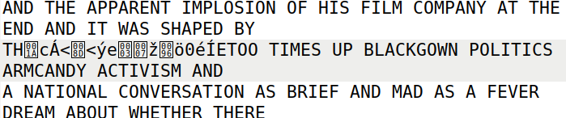

# Secret Key Encryption

# Introduction

This logbook explore the secret-key encryption concepts.

# Task 1

In this task we are challenged to decrypt a file that uses monoalphabetic substitution cipher.

To successfully decrypt the file we used the frequency analysis algorithm and step by step we discover all the corresponding letters:

```bash
tr 'ytnhlmusprieqxvazdbgfckojw' 'THERWINKDGLPSOACUYFBVMXJQZ' < ciphertext.txt > out.txt
```

# Task 2

Here we are invited to explore about 3 modes to encrypt files.

## Encrypt

### Modo aes-128-ecb (Electronic Codebook Mode)

```bash
$ openssl enc -aes-128-ecb -e -in plaintext.txt -out cipher_ecb.bin -K 00112233445566778889aabbccddeeff
```

- **Flags Used**: No IV is needed for ECB mode, only the key (`-K`) is required.

- **ECB** encrypts blocks independently without chaining, leading to potential patterns in the ciphertext if the plaintext is structured.

### Modo aes-128-cbc (Cipher Block Chaining Mode)

```bash
$ openssl enc -aes-128-cbc -e -in plaintext.txt -out cipher_cbc.bin -K 00112233445566778889aabbccddeeff -iv 0102030405060708
```

- **Flags Used**: Both the key (`-K`) and IV (`-iv`) are required-

- **CBC** chains blocks together by XORing each plaintext block with the previous ciphertext block.

### Modo aes-128-ctr (Counter Mode)

```bash
$ openssl enc -aes-128-ctr -e -in plaintext.txt -out cipher_ctr.bin -K 00112233445566778889aabbccddeeff -iv 0102030405060708
```

- **Flags Used**: Both the key (`-K`) and IV (`-iv`) are required.

- **CTR** mode generates a keystream from the key and IV, XORing it with the plaintext.

## Decrypt

### Modo aes-128-ecb (Electronic Codebook Mode)

```bash
openssl enc -aes-128-ecb -d -in cipher_ecb.bin -out decrypted_ecb.txt -K 00112233445566778899aabbccddeeff
```

- **Flags Used**: Only the key (`-K`) is required.

### Modo aes-128-cbc (Cipher Block Chaining Mode)

```bash
openssl enc -aes-128-cbc -d -in cipher_cbc.bin -out decrypted_cbc.txt -K 00112233445566778899aabbccddeeff -iv 0102030405060708
```

- **Flags Used**: Both key and IV are required.

### Modo aes-128-ctr (Counter Mode)

```bash
openssl enc -aes-128-ctr -d -in cipher_ctr.bin -out decrypted_ctr.txt -K 00112233445566778899aabbccddeeff -iv 0102030405060708
```

- **Flags Used**: Both key and IV are required.

## Main differrence between aws-128-ctr and the other modes

- **CTR is faster**: Blocks can be processed independently, allowing parallelism.

- **CTR** mode allows parallel encryption/decryption because the keystream is independent of the plaintext.

- **No block chaining**: Unlike CBC, CTR does not depend on previous ciphertext blocks, which avoids propagation of errors.

- **Stream cipher behavior**: CTR encrypts bit-by-bit instead of block-by-block.

# Task 5

In this task we change the byte 50*6 = 300 and whatch the results when the decryption of the file is done

### Modo aes-128-ecb (Electronic Codebook Mode)

Using this mode only the corrupted block is localized to a single block of 16 byts, and other blocks remain unaffected.

<div align="center">
    <figure>
        
        <figcaption style="font-size: smaller">Figure 1: Block Affected Using ECB Mode</figcaption>
    </figure>
</div>

### Modo aes-128-cbc (Cipher Block Chaining Mode)

In this mode the modification of the byte will corrupt the block of 16 bytes where that block is located and the first byte of the next block.

<div align="center">
    <figure>
        
        <figcaption style="font-size: smaller">Figure 2: Block Affected Using CBC Mode</figcaption>
    </figure>
</div>

### Modo aes-128-ctr (Counter Mode)

In this mode the corruption is localized to a single byte (only the byte modified is corrupted).

<div align="center">
    <figure>
        
        <figcaption style="font-size: smaller">Figure 3: Block Affected Using CTR Mode</figcaption>
    </figure>
</div>