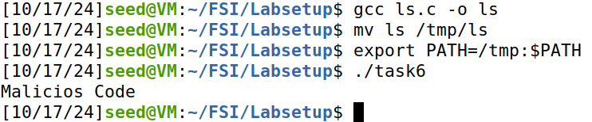
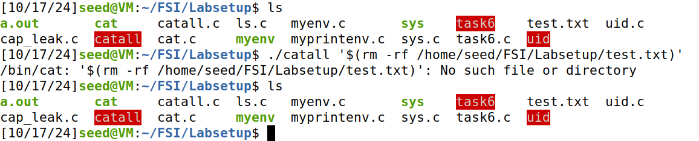

# Environment Variable and Set-UID Lab

## Task 1

In this task we tested some commands. 
The first command is `printenv` and we use this command to print out the enviroment variables. When we write only the command in the terminal it shows all the enviroment variables, but if we only want one enviroment variable expecifically then we can write "printenv PWD" in the terminal to print the PWD enviroment variable expecifically.
The two other command

## Task 2

When we compile and run the `myprintenv.c` file for the first time it will show us the environment variables of the system accessible by the child process. If we comment the `printenv` function of the child process and uncomment the same function in the parent process we will see that the same output will be printed.

Analysing this outputs we can conclude that when we use the function `fork()` an exactly copy of the parent process is created (child process) and both keep running in paralel (the system arbitrarily choose wich one execute first).

## Task 3

Compiling and running the original `myenv.c` file doesn't do nothing because we are not giving any environment variable to the program env (the third argumment is NULL).

After changing the third argumment to `environ` which gives access to the environment variables of the system the program actualy prints the environment variables correctly.

Analysing this we know that the function `execve()` receive in the first argumment the path to the executable (`/usr/bin/env`), in the second the argumment list (argv), and the third is the environment.

## Task 4

In this task we tested the function `system()` that like the function of the previous task `execve()` executes a command but in a different way. Actualy the function `system()` executes `/bin/sh` and asks the shell to execute the command.

Using this we dont need to pass the environment variables array because the shell already know what are the environment variables.

## Task 5

After compiling our program and change its ownership to root, and make it a Set-UID program it will execute with root's privileges.

After set the environment variables `PATH`, `LD_LIBRARY_PATH` and `CUSTOM_VAR` we runed the *Set-UID* program in our shell and the only the custom environment varibles, `PATH` and `CUSTOM_VAR`, have been printed. **But why?**

When we run *Set-UID* program in our shell, the shell forks a child process, and uses the child process to run the program, but analysing the environment variabels that get into the *Set-UID* child process we observe that the `LD_LIBRARY_PATH` variable doesn't get into it. This is because the operating system has a security measure that sanitize the environment to prevent privilege escalation attacks where a malicious user sets harmful values for variables like `LD_LIBRARY_PATH`.

## Task 6

In this task we have a program that run the `ls` command using the function `system()`. That program is supposed to execute the `/bin/ls` command however the program only uses the relative path for the `ls` command, `system("ls")`, so the system will search for the `ls` command in the directories listed in the `$PATH` environment variable.

```c
#include <stdio.h>
#include <stdlib.h>

int main(){
	system("ls");
	return 0;
}
```

Knowing this we can manipulate the `$PATH`, including a directory containing a malicious `ls` command that will be executed instead of the intended `/bin/ls`.

1. Create a program named `ls.c` and put the malicious code inside;

```c
#include <stdio.h>
#include <stdlib.h>

int main(){
	printf("Malicios Code\n");
	return 0;
}
```

2. Compile the program with the name `ls`;

3. Move the compile program `ls` to a directory, lets say `/tmp`;
4. Modify the `$PATH` environment variable;
5. Run the original program and watch the result.

<div align="center">
    <figure>
        
        <figcaption style="font-size: smaller">Figure 1: Exploit task 6</figcaption>
    </figure>
</div>

## Task 8

Here we will see the difference between use the `system()` function and use the `execve()` function.

The first step is compile the program and make it a root-owned *Set-UID* program. The first time we will use in the program the function `system()` to call the command `/bin/cat` to open a file that we pass through the `*argv[]`. The problem in this case is that `system()` uses the default shell to run the command we gave. Knowing this Bob can manipulate the input in the `*argv[1]`, he can insert addicional shell comands because the shell will interpret everything in the `command` string.

Here is an example of that:

<div align="center">
    <figure>
        
        <figcaption style="font-size: smaller">Figure 2: Exploit task8 step 1</figcaption>
    </figure>
</div>

Analysing this example we see that the file test.txt exists in the first `ls` command, then we execute the program `./catall` inserting an addicional bash command that will remove the file test.txt.

```bash
./catall '$(rm -rf /home/seed/FSI/Labsetup/test.txt)'
```

Using again the command `ls` we can see that we successfuly remove the test.txt file using this insert in the `*argv[1]`.

In the second step we do the same thing but the program uses the `execve()` function instead of the `system()` function. This time our strategy doesn't work because the `execve()` function doesn't lunch a shell to run the command we pass to it, instead it executes the program directly, replacing the current process.

Here is the example:

<div align="center">
    <figure>
        
        <figcaption style="font-size: smaller">Figure 2: Exploit task8 step 2</figcaption>
    </figure>
</div>

Like we said the function `execve()` directly executes the program and doesn't interpret strings, but rather, it runs the specified program with a well-defined argument list.

In the `execve()` function we explicity pass the path of the executable to run and the arguments to the executable.
